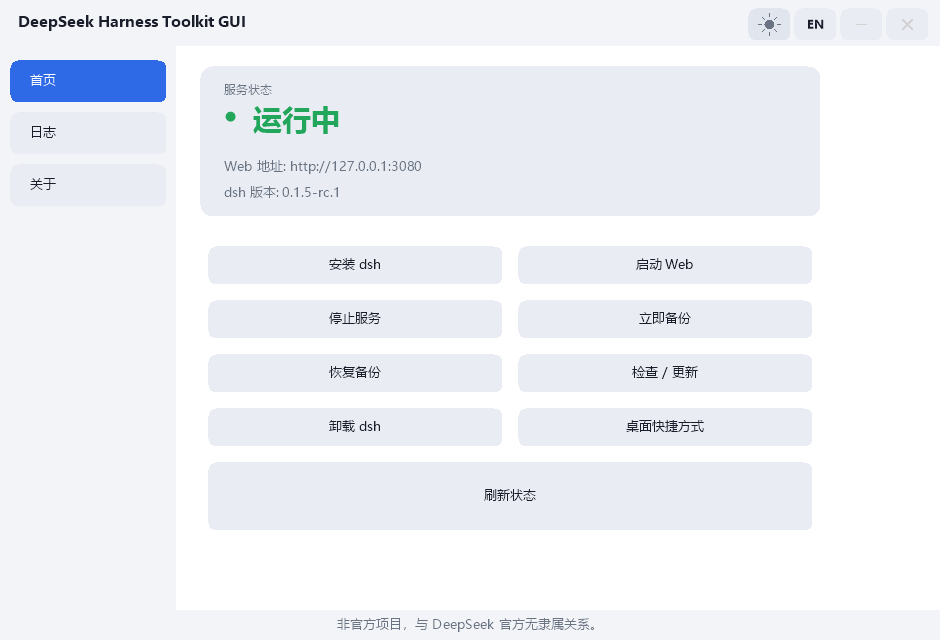
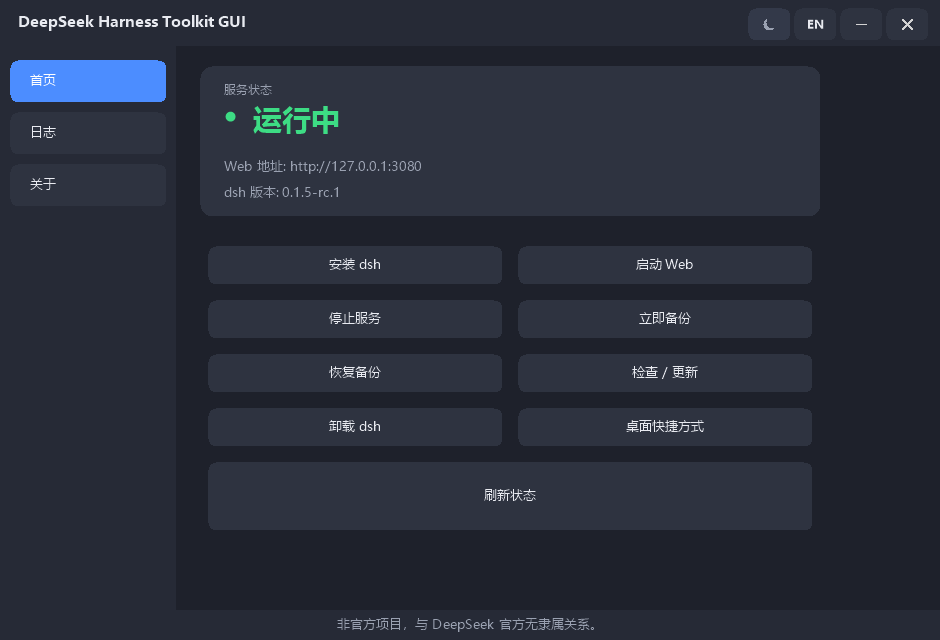
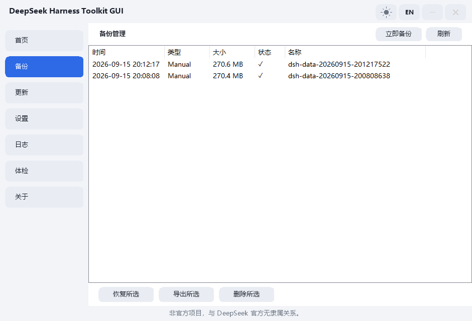
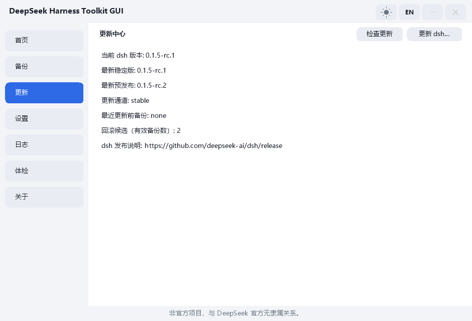
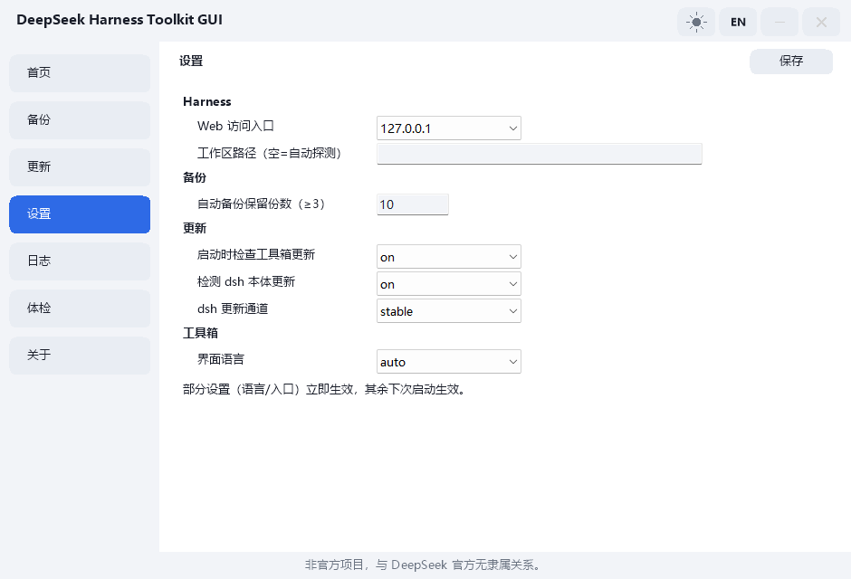
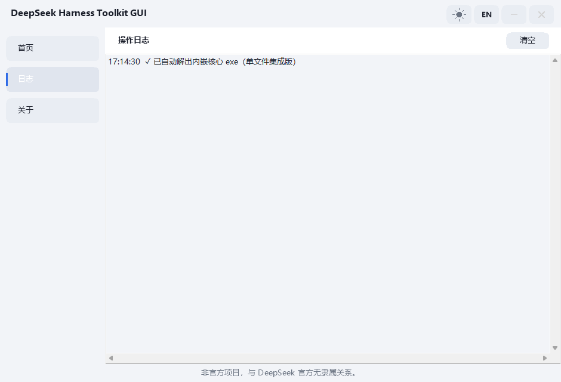
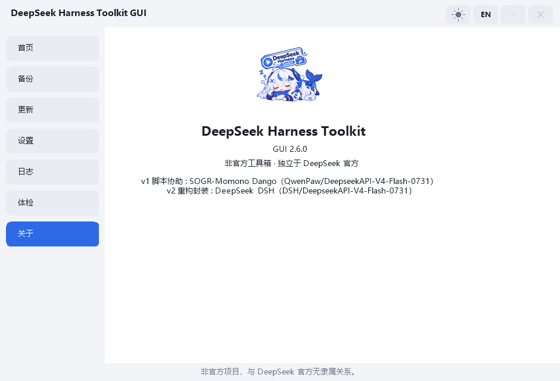
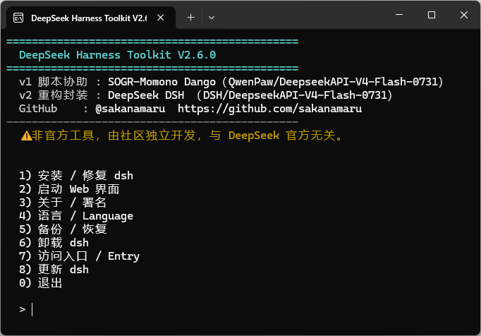
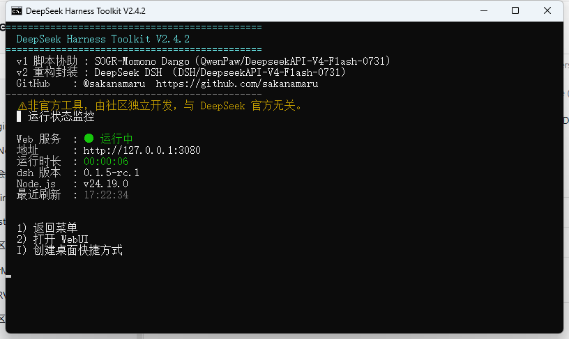

# DeepSeek Harness Toolkit

<div align="center">

**[English](README.md) · [简体中文](README_zh-CN.md)**


**Windows installer, monitor, backup & restore tool for the DeepSeek Harness (dsh) Web UI — double-click and go.**

</div>

A third-party, **unofficial** launcher / ops tool for [DeepSeek Harness](https://www.npmjs.com/package/@deepseek-ai/dsh) (dsh).
Install, start, monitor and uninstall the dsh Web UI, with data backup / restore built in. **No terminal required.**

> ⚠️ This project is **unofficial** and is not affiliated with DeepSeek.

## Official downloads

Only this repository's [Releases page](https://github.com/sakanamaru/DeepSeek-Harness-Toolkit/releases) ships official binaries — anything else (cloud-drive re-uploads, "paid / cracked / modified" editions, other websites or accounts) is **not official**. The project is free and open source (MIT); **no one is authorized to sell it**. Verify before running: `verify.ps1` checks SHA-256 against the CI-generated manifest and the GPG signature, and the GitHub artifact attestation is an **independent extra** provenance check that `verify.ps1` does not perform — attestation does not replace the GPG signature check either. The trust model, supply-chain controls and manual verification steps live in [SECURITY.md](SECURITY.md).

## Screenshots

The seven GUI pages (variants B / C) and the CLI core they drive (variant A — everything is also scriptable):

| Home — status & actions (light) | Home (dark) | Backups — list, restore / export / delete |
|:---:|:---:|:---:|
| <a href="docs/screenshots/gui-home-light.png"></a> | <a href="docs/screenshots/gui-home-dark.png"></a> | <a href="docs/screenshots/gui-backup-light.png"></a> |

| Update Center — read-only update picture | Settings — four config groups | Log Center — levels, filters, search, export |
|:---:|:---:|:---:|
| <a href="docs/screenshots/gui-update-light.png"></a> | <a href="docs/screenshots/gui-settings-light.png"></a> | <a href="docs/screenshots/gui-log-light.png"></a> |

| About — version, credits, unofficial notice | CLI — interactive menu | CLI — live status monitor (3-state) |
|:---:|:---:|:---:|
| <a href="docs/screenshots/gui-about-light.png"></a> | <a href="docs/screenshots/cli-menu.png"></a> | <a href="docs/screenshots/cli-status.png"></a> |

<sub>Click any screenshot to open the full-size image. The seven GUI pages come first; the last two are the CLI core the GUI drives — the interactive menu (everything is also scriptable: `install · start --bg · stop · backup · restore · status · about · …`) and the live monitor (3-state detection via port + HTTP, Web address, uptime, dsh &amp; Node.js versions, refreshed every 3s).</sub>

## What you can do with it

### Install DeepSeek Harness on Windows — double-click, no terminal

One exe detects the Node.js/npm environment, installs `@deepseek-ai/dsh` from the **official registry by default** (npmmirror opt-in, auto-retry with the other source on failure), then verifies what got installed. Nothing is installed without your keypress.

### Start, stop and monitor the dsh Web UI

Launch detects the service state — **running / starting / stopped** (TCP + HTTP verified, so a foreign process on :3080 is never mistaken for dsh) — auto-starts dsh with a 5-second countdown, opens your browser, and keeps a live status view (state / port / uptime, refreshed every 3s; red alert on disconnect).

### Back up and restore dsh data — including sessions and credentials

One-click **full backup** of the dsh data directory (`~/.dsh`) into `backup\` next to the exe; list-restore with confirmation, open-backup-folder; manual backups are kept forever, automatic ones follow the retention policy; every dangerous operation (restore / import / wipe / update) **auto-backs up first**.

### Migrate dsh to another PC

Copy the backup folder to the new machine and use **Import** — multi-workspace aware (`_workspace\name\`), compatible with old backup formats, long-path safe (`\\?\`, >260 chars).

### Backup Manager — see exactly what you backed up, before you touch anything

The GUI **Backups** page lists every backup as a row (time, kind: Manual / Auto / Pre-update / Pre-restore / Pre-wipe, size, validity) with **Restore / Export / Delete** for the selection and a one-click **Backup Now**; the list refreshes itself after any change. Restoring always runs a **Dry-Run first**: the confirm dialog shows how many files will be added, overwritten, or kept (destination-only files are never deleted) and roughly how much data will be copied — nothing changes until you confirm. The same plan is available headlessly via `restore --path <backup> --dry-run` (machine-readable `DRYRUN_*` lines), and the interactive wipe flow previews its delete counts (files / dirs / total size) before the two-step confirmation.

### Update or cleanly uninstall dsh

Menu-driven dsh updates (version list incl. rc pre-releases, destructive-action double confirm, pre-update backup; failure prints the backup location + manual rollback command — no silent half-states) and uninstall (data kept by default; wiping requires two-step confirmation and only runs while dsh is stopped).

### Update Center — know before you update

The GUI **Update** page visualizes the whole update picture read-only: current dsh version, latest stable, latest rc, update channel (`update_channel=stable|rc`), the most recent pre-update backup, rollback candidates (valid backup count), and a link to dsh release notes. **Check** refreshes on demand; **actually updating always goes through the interactive flow** (version list + destructive-action double confirmation) — checks may be automatic, updates never are.

### Settings page — change behaviour without editing config files

The GUI **Settings** page edits the toolkit's own configuration (`launcher.config`, still plain `key=value`) in four groups: **Harness** (Web host, workspace path), **Backup** (auto-backup retention, ≥3), **Update** (startup update check, dsh update detection, update channel), **Toolkit** (UI language, menu auto-start countdown, close-window behavior). **Save submits only the keys you actually changed**, and out-of-range values are refused core-side — a typo cannot quietly corrupt your config. Headless equivalents: `config-get` (read every key) and `config-set <key> <value>` (whitelisted write).

### Health check — "what exactly is broken?"

`doctor` (CLI) and the GUI **Doctor** page run a read-only seven-category check — System (Windows / Node / npm), Harness (installed & version), Service (port, listener identity, HTTP, 3-state), Workspace (path, permissions, size), Backup (dir, latest, age), Network (registry reachability), Integrity (the running exe vs the bundled `hashes.txt`: match / mismatch, reported as an error / no manifest found, normal for a single copied exe) — and end with a machine-readable verdict (`DOCTOR_OK 0` / `DOCTOR_WARN n` / `DOCTOR_ERROR n`). `doctor --report <file>` exports a full diagnostic report with API keys / tokens / cookies / passwords redacted.

### "dsh won't start" — from the error to the one line that fixes it

A real failure (2026-09-15): `dsh web` refused to boot with

```
plugin tree failed to load: … provider "kimi" cannot enforce maxDepth (no depthLimit capability) — set maxDepth: 'provider-managed' …
```

The cure is **one line** inside the existing profile entry's `config:` block. The profile patch layer is YAML where an entry with an `id` modifies an existing row and new rows must go under `insert:` — so this tool **never restructures the file, never adds or removes entries, and touches nothing else**. Four steps from the raw error to the prescription:

| # | Step | What tells you |
| --- | --- | --- |
| 1 | What the error says | `bootdiag` on the captured output, or `profilecheck` on the profile directory |
| 2 | Which plugin | `BOOTDIAG_PLUGIN` (e.g. `@deepseek-ai/dsh-tool-subagent`) |
| 3 | Which entry & line | `BOOTDIAG_ENTRY` + `BOOTDIAG_FILE` / `BOOTDIAG_LINE` (e.g. `tool-subagent-kimi`, line 20 of `cordis.patch.yml`) |
| 4 | The one-line prescription | `maxDepth: 'provider-managed'` inside that entry's `config:` block |

```powershell
# 1) Proactive scan (read-only): which profile entries would break a boot?
DeepSeek Harness Toolkit.exe profilecheck              # alias: pc
DeepSeek Harness Toolkit.exe profilecheck --vendor     # also scan node_modules (skipped by default)

# 2) Already failed to start? Save the startup output to a text file, then:
DeepSeek Harness Toolkit.exe bootdiag --from captured.txt    # alias: bdiag

# 3) The prescription — preview first, then apply (backup → verify → rollback on failure):
DeepSeek Harness Toolkit.exe profilepatch --file <yaml> --id <entry> --set maxDepth=provider-managed
DeepSeek Harness Toolkit.exe profilepatch --file <yaml> --id <entry> --set maxDepth=provider-managed --yes
```

In the GUI the **Doctor** page has a **Config Check** button that does the same thing: it runs `profilecheck`, and when fixable risks are found it asks for confirmation, then backs up and fixes them through `profilepatch` and rescans.

**Honest limit — the live crash is not detected for you.** Detecting this failure automatically from a live failed start is **not** automatic: the tool cannot see that crash by itself. Either run `profilecheck` proactively (a static, read-only scan of `~/.dsh/profiles/**/*.yaml|*.yml`) or save the failing startup output to a file and run `bootdiag --from <file>` (it never guesses — an unrecognized error prints `BOOTDIAG_KIND unknown` plus the first error line). The scan and both diagnostics are read-only; the write path requires an explicit `--yes`, always takes a backup first, adds only that one line, verifies by rescanning and rolls back automatically on failure, and it never touches credentials, never goes online and never edits files under `node_modules` by default. On the maintainer's own machine the scan found exactly one real leftover issue (`subagent-acp-kimi` missing `maxDepth`) across 7 profile files while skipping 563 package files under `node_modules`; `bootdiag` resolved the real captured stack to `@deepseek-ai/dsh-tool-subagent` / `tool-subagent-kimi` / line 20 of `cordis.patch.yml`; and `profilepatch` on a copy added exactly one line and reported NOOP on the second run.

### Log Center — filter, search, export

The GUI **Log** page is a structured operation log: every entry carries a level (`INFO / WARN / ERROR`) and a timestamp, with one-click level filters, a live search box, and **Export / Copy** buttons (export writes a UTF-8 text file). Failures — timeouts, refused operations, missing core — are logged as WARN/ERROR so you can jump straight to what went wrong.

### Tray, status bar and shortcuts

The GUI keeps a **tray icon** (Show Window / Start dsh / Stop dsh / Exit) and remembers what closing the window should do: the **first time** you close it, it asks once — minimize to tray or exit directly — and stores the answer in `close_action` (`ask | tray | exit`, empty = never asked), changeable later on the Settings page. A bottom **status bar** shows the service state, PID, uptime, the current theme and language plus shortcut hints (the headless equivalent is the read-only `status --detail`, which adds `STATUS_PID` / `STATUS_START` / `STATUS_UPTIME` to the three-state marker line); **`Ctrl+1`~`Ctrl+7`** switch pages, **`F5`** refreshes status and **`Ctrl+B`** runs a backup (text-input fields keep their own keys). Backup / restore / export / delete results come back as tray balloon toasts.

### "Verify This Install" — check what you downloaded

The About page has a **Verify This Install** button: it downloads the official `hashes.txt` (plain text — no JSON, no third-party dependency) and compares the SHA-256 of the core exe and the GUI exe against it, with three outcomes: **match / mismatch / could not verify**. The same comparison runs locally — no network — on every launch against the `hashes.txt` bundled beside the exe, and the **very first** launch runs that integrity self-check only (no environment inventory and no backup prompts on a machine that has neither yet). What it is, precisely: a **hash-consistency** check, **not** signature verification and **not** proof of publisher identity — see [SECURITY.md](SECURITY.md).

## Why this tool

| | Official (npm CLI) | This tool |
| --- | --- | --- |
| Target users | Developers comfortable with the terminal | Regular users / batch installs / remote assistance |
| Install | Install Node.js first, then type commands | Double-click the exe: detects the environment; you choose **(press 1)** whether to install dsh |
| Daily use | Manually open a terminal and browser every time | Detects on launch: auto-starts, opens the browser, monitors every 3s |
| Ops | None | Backup / restore / cross-PC import, uninstall (two-step confirm), entry switch, bilingual UI |
| Troubleshooting | Raw terminal errors | Friendly messages, health check, selftest report |

**Honest limits:**

1. **Unofficial maintenance.** No compatibility promise with future dsh versions. If dsh ever changes its default port / start command / data directory, this tool must be updated (those points have been stable so far).
2. **Trust boundary.** Distributing a Windows exe carries an inherent trust cost — hence this project is **fully open source (MIT)**, every release is **built by GitHub Actions CI from source**, and ships `hashes.txt` (SHA-256) + a **GPG signature** so anyone can verify releases.
3. **Positioning.** If you are comfortable with the terminal, the official npm commands are leaner; this tool is for people who do not want to touch one.

## 🖥️ GUI panel (three variants)

Since v2.4.1 a **graphical panel** ships in three forms — pick what fits (the panel is now **seven pages**: Home · Backups · Update · Settings · Log · Doctor · About; the screenshots above show Home / Log / About):

| Variant | File(s) | Unzip / run | For |
|---|---|---|---|
| **A. CLI core** | `DeepSeek Harness Toolkit.exe` | unzip fully, double-click | terminal users, scripts/automation |
| **B. GUI attached** | `Toolkit GUI.exe` + core **next to it** | **must unzip fully** — the GUI depends on the sibling core exe; a stray copy shows "Core exe (CLI) not found" | GUI users deploying with the core |
| **C. GUI standalone** | `Toolkit GUI Standalone.exe` | **single file, fully independent** — embeds the core and extracts it next to itself on first launch | "one exe handles everything" users |

**Shared features**: **seven pages** (Home — status LED + dsh version + Web address + action buttons · Backups — backup list with Restore / Export / Delete + Backup Now · Update — read-only update picture · Settings — four config groups, now incl. menu auto-start countdown and close-window behavior · Log — structured log with level filters, search, export/copy · Doctor — seven-category read-only health check (incl. exe vs bundled `hashes.txt`) · About — version, credits, unofficial notice, **Verify This Install**), dark/light theme, Chinese/English, borderless rounded window, embedded logo; **tray icon** (show / start dsh / stop dsh / exit), a bottom **status bar** (state · PID · uptime · theme · language) and `Ctrl+1`~`Ctrl+7` / `F5` / `Ctrl+B` shortcuts; actions **Start Web** (top-left) / Install dsh or Repair dsh (the label follows detection) / Stop Service / Backup Now / **Restore Backup (Dry-Run confirm dialog first)** / Check for Updates / Uninstall / Desktop Shortcut / Refresh Status. Starting Web while already running just opens the browser; current data is auto-backed up before any restore.

**Recommended usage**:

- **Everyday ops → C (standalone)**: backup/restore/start/stop all inside the GUI, one file is all you need
- **Scripts / automation / remote help → A (CLI core)**: programmatic (`status / start --bg / stop / backup / restore --path ...`)
- The **full zip** contains all three exes + docs; unzip and pick one. B and C can coexist (same core exe name, no conflict)

**Must unzip fully**:

- **Variant B**: GUI and core must live in the same folder; a lone GUI refuses operations with an explanation in the log
- Uninstall "Wipe all data" relies on the `.dsh_launcher_root` marker shipped in the package (**anti-mistake design; the program never creates it**): if you copy variant C to a fresh folder, that folder lacks the marker and wiping is safely refused — operate from the full package folder when you need to wipe

**Runs standalone**:

- **Variant C**: single exe, full functionality (embedded core extracted on first launch — via temp file + atomic rename, an interrupted extraction can never leave a broken exe)
- **Variant A**: single exe covers start/stop/backup/restore; install/wipe still work best from the full package (`.dsh_launcher_root` marker)

> The underlying CLI is exactly the core (install/update/uninstall still open a real console window for interaction).

## Quick start

1. **Download** the latest release from the [Releases page](../../releases/latest) — for everyday use grab `Toolkit.GUI.Standalone.exe` (variant C).
2. **Unzip** into its own folder (e.g. `D:\tools\`) — backups and config live next to the exe; putting it on the Desktop makes a mess. (Both the GUI and the CLI detect launches from Desktop/Downloads and warn you: the GUI asks for confirmation before continuing, the CLI prints a notice.)
3. **Double-click the exe.** dsh not installed → the menu waits for you; press **1** to install (official registry by default, npmmirror as an option, ~1–3 min). Run it again afterwards — the Web UI opens automatically.

## Usage

Double-click `DeepSeek Harness Toolkit.exe`, or use the command line:

```
DeepSeek Harness Toolkit.exe install|start|uninstall|update|check|about|help
DeepSeek Harness Toolkit.exe profilecheck|bootdiag|profilepatch     # when dsh won't start (see below)
```

Launching without arguments opens the interactive menu: with dsh installed the first run auto-starts the Web UI after a 5-second countdown (interruptible); later launches auto-start too. Set `auto_start=off` to drop the countdown — the menu then waits for a manual choice and says so. If dsh is **not** installed, the menu waits for your choice (press 1) — nothing is auto-installed. With the service already running, it goes straight to the status page.

**About workspaces:** backup auto-detects the workspace (two levels above the exe, rejecting obvious system/user dirs); you can also set it manually and persistently via menu **7 Entry → 3 Set workspace path** (the `ws=` line in `launcher.config`). **Multiple workspaces** are supported — add paths one by one (empty Enter to finish) — packed under `_workspace\name\` and restored one by one.

### FAQ

| Issue | Fix |
| --- | --- |
| dsh web won't start (`plugin tree failed to load`, `cannot enforce maxDepth`) | Run `profilecheck` (or save the startup output and run `bootdiag --from <file>`), then apply the one-line prescription with `profilepatch … --yes` — or use the GUI **Doctor → Config Check**. See the "dsh won't start" section above |
| 403 or blank page | Menu **7 Entry**, switch `127.0.0.1` ↔ `localhost` (the browser treats them as different sites; stale cache causes issues) |
| Delete failed during uninstall / wipe | Close the dsh web window first (file locks), retry; see `logs\launcher.log` if it still fails |
| Backup failed | Check `logs\launcher.log` next to the exe for the real reason |
| Backup failed (PathTooLongException) | Long path support and `dsh-data-*` skipping are built in; if the log still shows path issues, move that folder out of the workspace |
| Prompted for extra paths | Type each extra workspace path (empty Enter to finish), or preset one under **7 Entry → 3** |
| GUI says "Core exe (CLI) not found" | Variant B must sit **next to** `DeepSeek Harness Toolkit.exe` — unzip the full package, or use variant C (standalone) instead |

## Build from Source

Requires the built-in .NET Framework 4.x on Windows (preinstalled on Win10 / Win11):

```
"%WINDIR%\Microsoft.NET\Framework64\v4.0.30319\csc.exe" /nologo /optimize+ /target:exe /win32icon:icon.ico "/out:DeepSeek Harness Toolkit.exe" dsh_v2.cs src\Core\*.cs src\Platform\Windows\*.cs src\Cli\*.cs /warn:4
```

Or double-click `build_exe.cmd` in this directory. The GUI compiles from the same-rules single file `gui_v2.cs` (one source → both attached and standalone variants; the standalone adds `/resource:<core exe>,DSHCore.exe`).

> The `src\` globs in the command above belong to the **v2.8 stage 1 layout, complete as of 2026-09-21** — the **move-only** split of the single 4000+ line `dsh_v2.cs` into `partial class Program` layers (see Directory Layout). The **released v2.7.2** core is still the single file `dsh_v2.cs`: to rebuild that, drop the three `src\` globs. `csc.exe` does not expand wildcards itself — when an explicit file list is needed, expand them with `Get-ChildItem src -Recurse -Filter *.cs`.

**Reproducible releases (source == artifact):** each GitHub Release exe is compiled from this source by **GitHub Actions CI**, and `hashes.txt` is regenerated + **GPG-signed** by CI in the same run. Tag builds additionally publish a **GitHub artifact attestation** — an independent provenance check, verified separately with `gh`; `verify.ps1` does not check it, and it does not replace the GPG signature check. The repository stores no binaries.

## Development / Testing

No test framework or third-party dependency is required.

- **Unit tests (297)** — same-assembly test proxy (`/define:UNIT`; the test entry point is `tests\unit_tests.cs`, everything else is the production code being tested):
  ```
  "%WINDIR%\Microsoft.NET\Framework64\v4.0.30319\csc.exe" /nologo /target:exe /define:UNIT /out:unittests.exe dsh_v2.cs tests\unit_tests.cs
  unittests.exe
  ```
  Exit code 0 = all green. Covers: path round-trips (incl. UNC / non-ASCII), workspace blacklist, dsh-data markers, root marker strictness, backup dir validation, log rotation, backup naming + retention policy, service-state judging, version compare / release parsing / update detection, netstat PID parsing, dry-run merge/delete planning (incl. restore-side skip-rule fidelity), backup kind parsing, export / delete validation, rollback-candidate lookup, configuration whitelist (incl. the `close_action` / `auto_start` keys), status-bar uptime formatting, profile block scanning / `bootdiag` output parsing / the controlled patch path (one-line plan, idempotent NOOP, backup, verify and rollback).

- **Integration tests (33 cases)** — stubbed end-to-end matrix (variants A/C, real 3080 probing; retention policy, restore/import blocked while running, bilingual asserts):
  ```
  pwsh -NoProfile -File tests\integration.ps1
  ```
  Touches only the stubbed data dir `~/.dsh_test` — never your real `~/.dsh`. When port 3080 is closed, "running"-related cases are SKIPped, not failed. Exit code 0 = all green.

- **CI** — GitHub Actions runs both test suites **plus a three-variant GUI compile guard** on every push to `main`, every pull request, and every `v*` tag; release assets + `hashes.txt` (+ GPG signature) are rebuilt only on `v*` tag push or manual dispatch (`workflow_dispatch`).

## Directory Layout

```
dsh_v2.cs            CLI core entry partial — file header / assembly attributes / test proxy (C#5, no third-party deps)
src/Core/Program.Config.cs         Config read/write + whitelist validation
src/Core/Program.Backup.cs         Backup / restore / export / delete, DryRun, PlanMerge / CopyTree
src/Core/Program.Doctor.cs         Health-check DocItem set
src/Core/Program.Profile.cs        profilecheck / bootdiag / profilepatch
src/Core/Program.Integrity.cs      Self-integrity + manifest parsing
src/Core/Program.Update.cs         Version / channel / update info, npm version checks
src/Core/Program.Util.cs           Pure helpers (no Win32, no console)
src/Platform/Windows/Program.Platform.cs   P/Invoke, port & process probing, desktop & shortcuts, StateDir/DataRoot, console helpers
src/Cli/Program.Cli.cs             Main, interactive menu, Banner/Help, non-interactive *Cli commands
gui_v2.cs            GUI source (WinForms; one file → attached + standalone variants)
app.manifest         GUI manifest (DPI awareness / compat)
build_exe.cmd        Rebuild script (core)
icon.ico             Program icon
logo.png             Product logo (1536×1536)
verify.ps1           One-click release verification (SHA-256 + GPG)
keys/                Maintainer GPG public key
SECURITY.md          Security policy, data & network boundaries
CHANGELOG.md         Release history (bilingual)
hashes.txt           SHA-256 manifest (regenerated by CI per release)
tests/               Unit (297) & integration (33) tests — no third-party deps
docs/screenshots/    README screenshots
.github/workflows/   CI: tests on push/PR; release build + GPG sign on tag/dispatch
.dsh_launcher_root   Install marker (shipped in the package; deletion guard)
backup/  logs/       Runtime dirs (gitignored — never committed)
```

> **The `src/` lines above are the v2.8 stage 1 layout, complete as of 2026-09-21 — not a released state.** Stage 1 is a **move-only** split of the single 4000+ line `dsh_v2.cs` into `partial class Program` layers (`partial` within the same assembly, so no call site, signature or behaviour changes); it landed in commit ee36ac0 (CI green). The released **v2.7.2** still builds from the single file `dsh_v2.cs`. Stage 1 does not touch `gui_v2.cs`, `tests/unit_tests.cs` or `verify.ps1`.

## Error Log

- Runtime errors (backup / restore / uninstall failures, process start failures, etc.) are written to `logs\launcher.log` next to the exe (timestamped; rotated to `launcher.log.1` once it exceeds 1 MB).
- The log records error messages and file paths only — never passwords / API credentials. It is gitignored and never committed.

## Security Notes

- Full policy: see `SECURITY.md` (private reporting via GitHub Security Advisories).
- **Verify before you run (≈20 seconds)**:

  ```powershell
  powershell -ExecutionPolicy Bypass -File verify.ps1 -Tag v2.7.0 -OutDir D:\verify
  ```

  `verify.ps1` (shipped in the package) downloads the release artifacts (all three
  variants + `hashes.txt`), checks SHA-256 against the CI-generated `hashes.txt`,
  verifies the GPG signature (`hashes.txt.asc`) **against the pinned maintainer
  fingerprint** using a temporary isolated keyring (your local keyring is never
  trusted — a signature made by any other key is rejected), and prints the
  **Release → Tag → Commit** provenance chain (tag object, commit, commit URL).
  Read-only — installs nothing. With `-Tag` it uses fixed release
  download URLs and never calls the GitHub API (immune to anonymous rate limits);
  without `-Tag` it resolves the newest release via the API (optional `-Token` for
  rate-limited networks).
- **GPG signature**: `hashes.txt` is signed with the maintainer's key (`hashes.txt.asc`);
  public key `keys/sakanamaru-gpg.asc`, fingerprint
  `A2F67D170B5BE4845612642C240979232B4E4CE4`.
- **GitHub artifact attestation — an independent extra check**: tag builds also publish a
  GitHub artifact attestation; verify it with
  `gh attestation verify <file> --repo sakanamaru/DeepSeek-Harness-Toolkit`. `verify.ps1` does
  **not** verify attestations, and the attestation does **not** replace the GPG signature
  check — the two are independent, so pick either or (better) run both.
- **What the built-in integrity checks prove — and what they do not**: the GUI's
  "Verify This Install" button, the startup/first-run consistency check and the doctor
  `Integrity` category only compare a file against the `hashes.txt` shipped next to it —
  replacing **both** the exe and that manifest would pass them, so they prove consistency,
  **not** publisher identity. Identity/provenance comes only from the GPG-signed `hashes.txt`
  (or `verify.ps1`) and the GitHub attestation. These checks are read-only (so is
  `status --detail`), and HTTPS requests explicitly enable TLS 1.2 — see
  [SECURITY.md](SECURITY.md).
- Uninstall **"Wipe all data"** deletes the dsh data directory (`~/.dsh`, including sessions and API credentials) — the tool auto-backs it up to `backup\` first.
- Deletion is guarded **three ways**:
  1. **Blocked while the dsh Web service is running** (avoids file locks).
  2. The launcher root marker (`.dsh_launcher_root`) must exist **inside the package folder** — it is shipped with the release package, the program never creates it itself, and a stray exe copied elsewhere is permanently refused.
  3. The target directory must contain dsh-data markers (`settings.yaml` / `credentials.yaml` / `sessions` …).
  Any mismatch → deletion is refused.
- This tool only touches local data; the source contains no credentials or personal information.
- Backups are a best-effort file copy, not a transaction snapshot — for the most consistent backup, stop dsh before backing up.

## Redistribution & Credits (please read)

This project is open source under the MIT License. You are free to use, modify and redistribute it, but you MUST follow these rules:

1. **Keep the credits.** The v1 / v2 contributor credits and GitHub links in the app (startup banner / About page / file properties) and in this document must not be removed or replaced.
2. **Keep the claims.** The "Unofficial" notice and this LICENSE copyright statement must be distributed with every copy.
3. **Truthful attribution.** For commercial or redistributed releases, credit the source repository and original authors; removing credits is treated as infringement, and the authors reserve the right to file complaints (incl. DMCA) and pursue legal action.
4. **Verify releases.** `hashes.txt` in this repository records SHA-256 fingerprints of official release files; any binary claiming to be "officially compiled" can be verified against it.

## License

[MIT License](LICENSE)

## Acknowledgements

- [DeepSeek Harness (dsh)](https://www.npmjs.com/package/@deepseek-ai/dsh)
- Logo: designed with the assistance of ChatGPT (OpenAI), re-cropped for v2
- v1 script assistance: SOGR-Momono Dango（QwenPaw/DeepseekAPI-V4-Flash-0731）
- v2 rewrite & packaging: DeepSeek DSH（DSH/DeepseekAPI-V4-Flash-0731）
- GitHub: @sakanamaru  https://github.com/sakanamaru

If this tool helped you, a ⭐ on the repo's top right would mean a lot — it keeps this project going.
