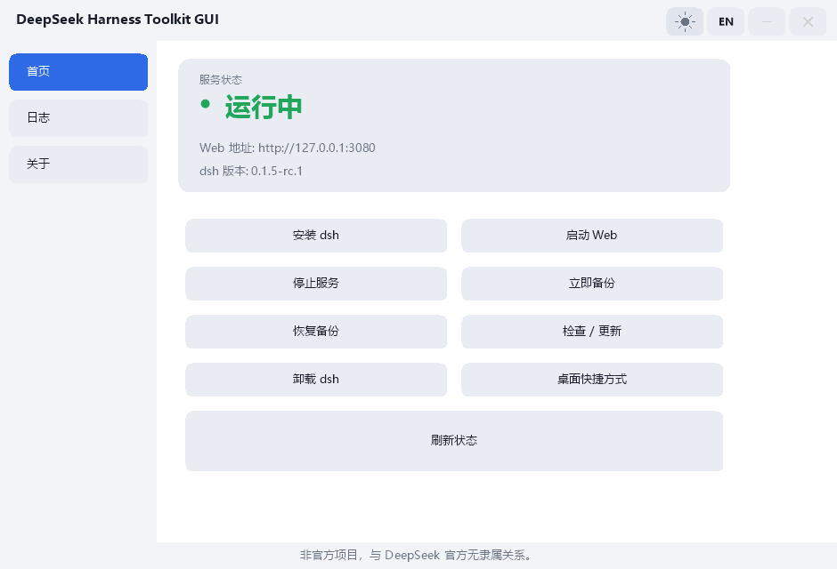
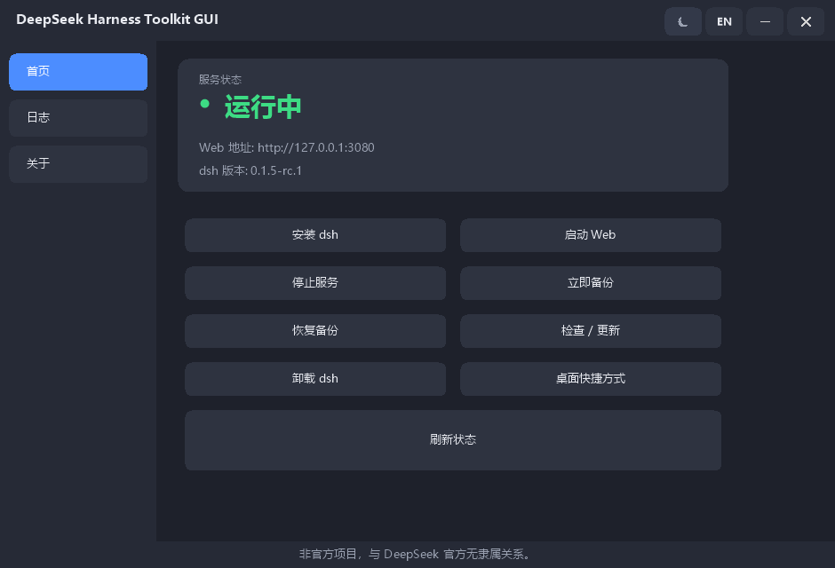
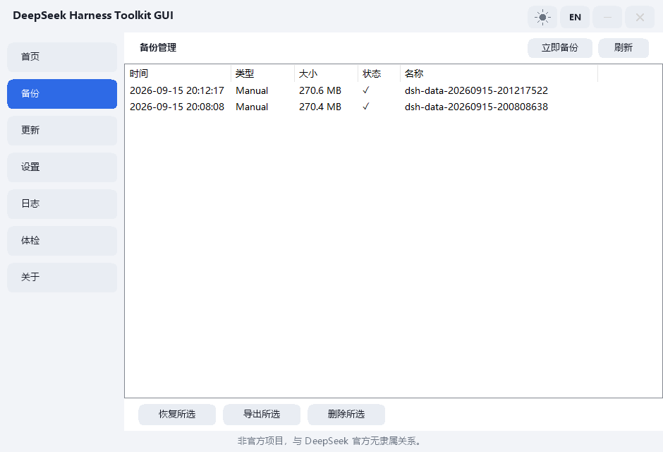
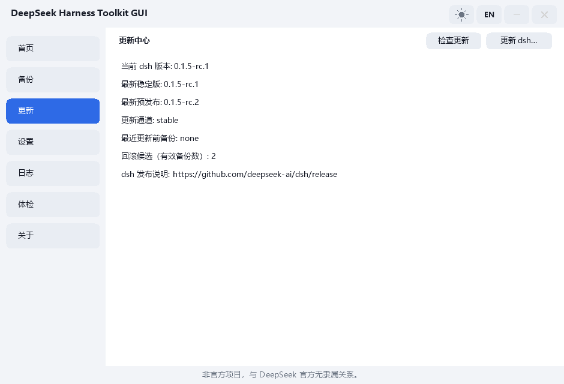
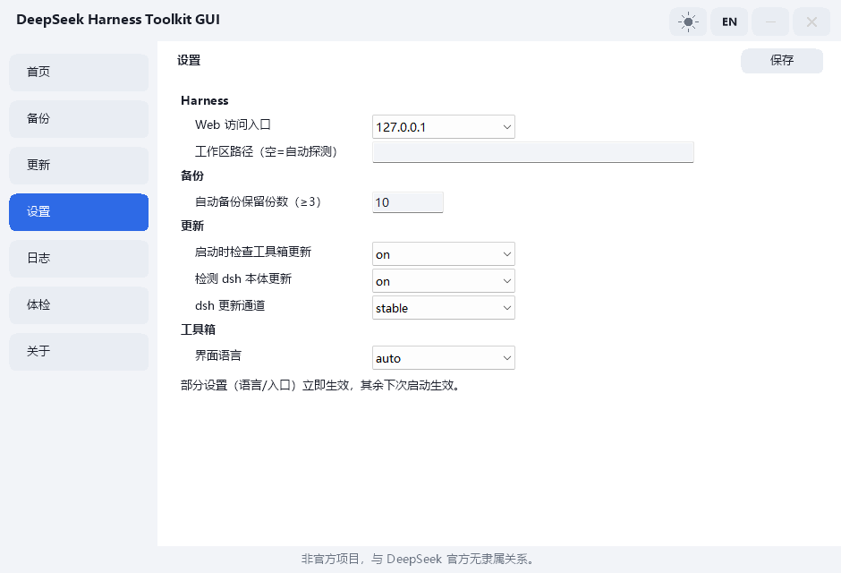
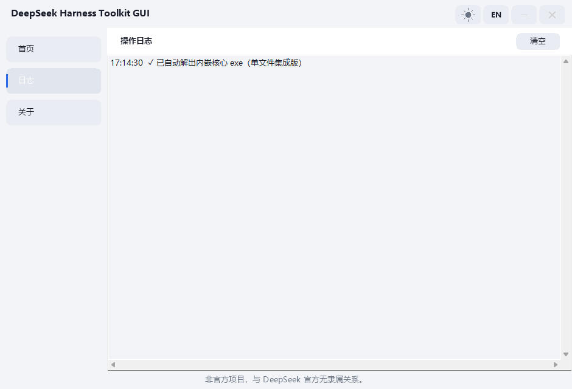
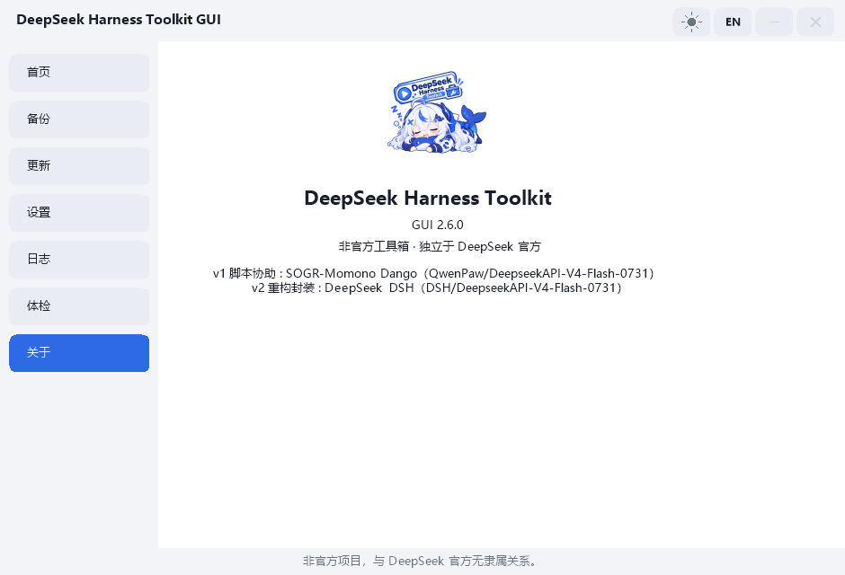

# dsh-minato

<div align="center">

**[English](README.md) · [简体中文](README_zh-CN.md)**


**DeepSeek Harness（dsh）Web 界面的第三方非官方启动 / 运维小工具——双击即用，无需终端。**

</div>

DeepSeek Harness（dsh）Web 界面的第三方非官方启动 / 运维小工具：
安装、启动、监控、卸载，附带数据备份/恢复，**双击即用**，不需要碰命令行。

> ⚠️ 本项目为**非官方**工具，与 DeepSeek 官方无关。

## 你可以依赖的保证

这是一个会动你数据的工具，所以它的承诺应该**可核对**，而不是靠信任。下面四条都在**真机**上验证过（Windows 与 Linux 各一遍），并写明**验证方法**，你可以自己复现。

- **恢复永远不会删除只存在于你这边的文件。** 合并只覆盖同名文件、补上新增文件；备份里没有的东西一概不动。dry-run 会打印它将**新增/覆盖/保留**的数量，而真实恢复的结果与预览一致。
- **会话统计从不读取你的对话正文。** 它只读 dsh 自己的元数据投影。验证方式：把对话文件设为**不可读**后统计仍然正常，因此它不可能读过正文。
- **卸载只移除程序，不动你的数据。** `uninstall` 只移除 dsh 包，数据目录与全部备份原封不动，而且在动手之前就在计划里写明了这一点。之后再装回来可用、且**设置保持不变** ✓ —— 这条往返已端到端验证过（含"用卸载前做的备份恢复"✓）。
- **备份能自证完整。** 每个备份旁边有一个**最后写入**的完成标记，含内容哈希：中断的备份可被发现、被改动的内容可被发现，从不完整的备份恢复会被拒绝（除非你显式加 `--force`）。

**不在这份清单上的，就不是保证。** 特别是：完成标记出现之前写的备份没有标记，它们会被报告为**未知**，而不是被当成好的。
## Linux 支持（预览）

V3 线今天就能在 Linux（x86-64）上跑：CLI 已完整移植，Avalonia GUI 也能编译并运行。
这一节把 Linux 的现状写清楚，免得你踩到才发现。

### Linux 上已经能用

- **全部 CLI 命令**：install / update / uninstall、start / stop、status、doctor、sessions、profiles、
  profilecheck、profilepatch、backup / backup-list / backup-export / backup-delete、restore、
  config-get / config-set、bootdiag、check、selftest、shortcut、ui、about，以及无参数数字菜单。
- **一键安装**：`dsh-minato install --install-node --yes` **免 sudo** 把官方 Node LTS 装到 `~/.local/node`
  （curl / wget / python3 有哪个用哪个 ✓），再用 npm 装 dsh；Node 按你的 CPU 架构选择（x64 / arm64 / armv7l / x86）。
- **一键启动 / 停止**：`start --yes` 脱离终端启动，**只有端口或 HTTP 探测确认后才报成功**；
  `stop --yes` 对**整个进程组**发信号并复检。
- **每个写操作都先打印计划、加 `--yes` 才执行**；真实恢复还要求设置 `DSH_HOME`（会规范化为绝对路径），
  因此**永远不会写你的默认数据根**。
- **Avalonia GUI 能在 Linux 上编译并运行**（X11，或经 XWayland 走 Wayland）。

### 平台本质差异（不是缺陷）

- 三个经典可执行文件（`DeepSeek Harness Toolkit.exe`、`Toolkit GUI*.exe`）与 `.lnk` 快捷方式是
  Windows / .NET Framework 专有，**Linux 包里不含它们**。
- `shortcut` 在 Linux 上创建的是**应用菜单项**（`~/.local/share/applications/dsh-minato.desktop`），
  不是桌面图标。
- `--install-node` 只在 Linux 上可用；Windows 的 Node 由安装器负责。

- **工作区自动探测在两侧的基准不同，这是必要的。** Windows 上取**可执行文件所在目录的上两级**（v2.x 的规则：exe 在 `...\dsh-minato\` 时工作区为 `...\`）；Linux 上可执行文件通常装在 `~/.local/bin`，同一条规则会指向 `~/.local`（没有意义），所以 Linux 改为取**你运行命令时所在的目录**。两种情况里显式的 `ws=` 配置都优先 ✓；看起来不合理的位置（家目录本身、盘根、系统目录）会被拒绝 ✓，交由你手动指定 ✓。
### Linux 上的已知缺口（有跟踪，3.0 前补齐）

- GUI 的「一键启动/停止」「运行检查」「隔离/恢复」按钮仍调用 Windows 专有的经典核心；
  它们背后的 CLI 在 Linux 上已经可用，所以这是**接线**问题而非能力缺失。
- 备份会把**自动探测到的工作区**打包进 `_workspace/`，恢复时合并回去；在 `ws=` 里用 `;` 分隔多个路径即可备份**多个工作区** ✓（写入恢复侧认识的**多工作区**（`.dshws`）格式 ✓）；只写一个路径时仍用旧式扁平格式 ✓，两种都能正常恢复 ✓。
- **GUI** 仍无日志中心、更新中心、导入备份、清除数据、托盘与快捷键；但这些**能力**在 **CLI** 上已经具备 ✓（`log` / `update-info` / `import` / `wipe` 在 Linux 上今天就能用 ✓）—— 这里缺的是 **GUI 界面**，不是能力 ✓。
- `keep_backups` **已按配置生效**：自动备份保留配置的份数（默认为 10）。
- 经典 v2.x 线若在 Linux 上从源码构建，`start` / `stop` / `shortcut` 三处接缝是坏的，且不认 `$DSH_HOME`；
  Linux 上请使用 V3 CLI。

### Linux 发布产物

每次发布会附上 `dsh-minato-linux-x64.tar.gz`，内含两份 CLI 构建（小的 framework-dependent 与**自包含单文件**）、
自包含 GUI、`.desktop` 入口、图标、冒烟脚本、简短说明与 sha256 清单。用
`v3/tools/verify-linux.sh <tarball> [<tarball.sha256>]` 校验 —— 与 CI 上传前跑的是同一个脚本。
运行时依赖：iproute2（`ss`）、`ps`，以及引导 Node 时的 `tar` 加 curl/wget/python3 之一。

## 官方下载

只有本仓库的 [Releases 页面](https://github.com/sakanamaru/dsh-minato/releases) 提供官方产物——其他任何来源（网盘二次上传、"收费 / 破解 / 修改版"、其他网站或账号）均**非官方**。本项目免费开源（MIT），**任何收费售卖均未经授权**。运行前请核验：`verify.ps1` 对照 CI 生成的清单校验 SHA-256 并验证 GPG 签名，而 GitHub 构建溯源证明（attestation）是**独立的额外**溯源检查，`verify.ps1` **不会**验证它，它也不能替代 GPG 签名校验。信任模型、供应链控制与手动核验步骤见 [SECURITY.md](SECURITY.md)。

## 界面截图

七个 GUI 页面（B / C 版本）与它们驱动的 CLI 核心（A 版本——一切皆可脚本化）：

| 首页——状态与操作（浅色） | 首页（深色） | 备份管理——列表 + 恢复/导出/删除 |
|:---:|:---:|:---:|
| <a href="docs/screenshots/gui-home-light.png"></a> | <a href="docs/screenshots/gui-home-dark.png"></a> | <a href="docs/screenshots/gui-backup-light.png"></a> |

| 更新中心——只读更新全貌 | 设置——四组配置 | 日志中心——级别筛选、搜索、导出 |
|:---:|:---:|:---:|
| <a href="docs/screenshots/gui-update-light.png"></a> | <a href="docs/screenshots/gui-settings-light.png"></a> | <a href="docs/screenshots/gui-log-light.png"></a> |

| 关于——版本、署名、非官方声明 | CLI——交互菜单 | CLI——实时状态监控（三态） |
|:---:|:---:|:---:|
| <a href="docs/screenshots/gui-about-light.png"></a> | <a href="docs/screenshots/cli-menu.png"></a> | <a href="docs/screenshots/cli-status.png"></a> |

<sub>点击任意截图可查看原图。前七张是 GUI 七页；后两张是 GUI 所驱动的 CLI 核心——交互菜单（所有操作同时可脚本化：`install · start --bg · stop · backup · restore · status · about · …`）与实时监控（三态检测：端口＋HTTP 双重校验、Web 地址、运行时长、dsh 与 Node.js 版本，每 3 秒刷新）。</sub>

## 能用它做什么

### 在 Windows 上安装 DeepSeek Harness——双击即可，无需终端

单个 exe 自动检测 Node.js/npm 环境，**默认从官方源**安装 `@deepseek-ai/dsh`（国内镜像 npmmirror 可选，失败自动换源重试），装完还会验证安装结果。没有你的按键确认，什么都不会装。

### 启动、停止并监控 dsh Web 界面

打开即检测服务状态——**运行中 / 启动中 / 已停止**（端口＋HTTP 双重校验，其他程序占用 3080 不会误判）——5 秒倒计时自动启动 dsh、打开浏览器，并保持实时状态页（状态/端口/运行时长，每 3 秒刷新，掉线红字提醒）。

### 备份与恢复 dsh 数据——包括会话与凭据

一键**全量备份** dsh 数据目录（`~/.dsh`）到 exe 旁的 `backup\`；列表式恢复带确认、可直接打开备份文件夹；手动备份永久保留，自动备份按保留策略清理；每个危险操作（恢复/导入/清除/更新）前都会**先自动备份**兜底。

### 能自证完整的备份

现在每个备份旁边都有一个**完成标记**（`<包名>.manifest`），**最后写入** ✓，记录文件数、字节数与**整包内容的 SHA-256** ✓。由此有三件事：

- **中断的备份可被发现** ✓：标记只在复制**完成后**才写 ✓ → 没有标记的包就是**没写完**的 ✓ → `backup-list --verify` 会报 `incomplete` ✓，而不是把它当成可用的备份悄悄列出来 ✓。
- **被改动或损坏的内容可被发现** ✓：`backup-list --verify` 会重算哈希 ✓，不一致时报 `mismatch` 并明确写出「**不要依赖它**」✓ —— 这能发现「**只拷了一半**」的文件 ✓（**这是文件计数看不到的** ✓✓）。
- **从不完整的备份恢复会被拒绝** ✓：`restore` 与 `restore --dry-run` 在动任何数据之前先核对标记 ✓，不一致时**明确报出数字并拒绝** ✓；确实要用就加 `--force` ✓。

标记会随 `backup-export` 与 `import` **一起迁移** ✓ → 备份搬到另一台机器后**仍可核对** ✓。本功能之前写的包没有标记 ✓ → 它们被当作「**未知**」而不是被拒绝 ✓ → **老包不会因此失效** ✓。
### 把 dsh 迁移到另一台电脑

把备份文件夹拷到新电脑，用**导入**即可——支持多工作区（`_workspace\名称\`）、兼容旧格式备份包、内置长路径支持（`\\?\`，>260 字符）。

### 备份管理器——动数据之前，先看清备份了什么

GUI **备份**页把每条备份列成一行卡片（时间 / 类型：手动 / 自动 / 更新前 / 恢复前 / 清除前 / 大小 / 有效性），选中后可**恢复 / 导出 / 删除**，一键**立即备份**；任何变更后列表自动刷新。恢复永远**先 Dry-Run**：确认框显示将新增 / 覆盖 / 保留多少文件（仅目标端存在的文件不会被删除）、待复制约多大——确认之前什么都不改。无界面同样可用：`restore --path <备份> --dry-run`（机器可读 `DRYRUN_*` 行）；交互清除流程在两步确认前也会先预演删除量（文件数 / 目录数 / 总大小）。

### 更新或干净地卸载 dsh

菜单式 dsh 更新（版本列表含 rc 预发布、破坏性操作双确认、更新前自动备份；失败会打印备份位置与手动回滚命令——不留静默半状态）与卸载（默认保留数据；清除数据需两步确认且仅在 dsh 停止时执行）。

### 更新中心——更新之前，先看全貌

GUI **更新**页只读可视化整幅更新图景：当前 dsh 版本、最新稳定版、最新 rc、更新通道（`update_channel=stable|rc`）、最近一次更新前备份、回滚候选（有效备份数）、dsh 发布说明链接。「检查更新」按需刷新；**真正更新永远走交互流程**（版本列表 + 破坏性双确认）——检查可以自动，更新绝不自动。

### 设置页——改行为不必手改配置文件

GUI **设置**页把工具箱自身配置（`launcher.config`，仍是明文 `key=value`）分成四组：**Harness**（Web 主机 / 工作区路径）、**备份**（自动备份保留份数，≥3）、**更新**（启动更新检查 / dsh 更新检测 / 更新通道）、**工具箱**（界面语言 / 菜单倒计时自动启动 / 关闭主窗口时）。**保存只提交你真正改动过的键**，越界值由核心侧白名单拒绝——打错字不会悄悄写坏配置。无界面对应命令：`config-get`（读全部键）、`config-set <键> <值>`（白名单写入）。

### dsh 起不来 / 插件加载失败怎么办——从报错到那一行处方

真实故障（2026-09-15）：`dsh web` 启动失败，报

```
plugin tree failed to load: … provider "kimi" cannot enforce maxDepth (no depthLimit capability) — set maxDepth: 'provider-managed' …
```

处方是**一行**：在已有 profile 条目的 `config:` 块里补 `maxDepth: 'provider-managed'`。profile 补丁层是 YAML——带 `id` 的条目 = 修改已有行，新增行必须放进 `insert:`——所以本工具**绝不重构文件结构、绝不新增/删除条目、不动其他任何内容**。从原始报错到处方共四步：

| 步骤 | 看什么 | 数据来源 |
| --- | --- | --- |
| 1 报错说了什么 | 属于哪类启动失败 | 把启动输出存成文件后跑 `bootdiag`，或直接对 profile 目录跑 `profilecheck` |
| 2 哪个插件 | 病灶插件包 | `BOOTDIAG_PLUGIN`（例：`@deepseek-ai/dsh-tool-subagent`） |
| 3 哪个条目、哪一行 | 具体条目与行号 | `BOOTDIAG_ENTRY` + `BOOTDIAG_FILE` / `BOOTDIAG_LINE`（例：`tool-subagent-kimi`，`cordis.patch.yml` 第 20 行） |
| 4 一行处方 | 要补的那一行 | 在该条目 `config:` 块内加 `maxDepth: 'provider-managed'` |

```powershell
# 1) 主动预检（只读）：哪些 profile 条目会让 dsh 起不来？
dsh-minato.exe profilecheck              # 别名：pc
dsh-minato.exe profilecheck --vendor     # 连 node_modules 一起扫（默认跳过）

# 2) 已经起不来了？把启动输出存成文本文件，然后：
dsh-minato.exe bootdiag --from captured.txt    # 别名：bdiag

# 3) 处方——先预览，确认后再落盘（先备份 → 复扫校验 → 失败自动回滚）：
dsh-minato.exe profilepatch --file <yaml> --id <条目> --set maxDepth=provider-managed
dsh-minato.exe profilepatch --file <yaml> --id <条目> --set maxDepth=provider-managed --yes
```

**不止 `maxDepth`：任何坏插件都能先隔离掉。** 上面那行处方让插件**继续可用**；当坏插件身份不明、或你只想先让 dsh 起来时，可以往补丁文件**末尾追加**一个顶层条目把这一行关掉（**只追加**，不改动你 profile 里任何已有字符）：

```powershell
dsh-minato.exe profilepatch --disable <条目 id>          # 预览（PROFILEPATCH_DRYRUN，零写入）
dsh-minato.exe profilepatch --disable <条目 id> --yes    # 先备份 → 追加 → 复检 → 失败逐字节回滚
```

`disabled: true` 是 **dsh 自己补丁层的一等字段**（`@deepseek-ai/cordis-plugin-include` 的 `PatchOptions.disabled`），dsh 自己关遥测行就用它——所以这是"关掉那一行"的正统写法，不是重写你的 profile。它**只做手动操作、绝不自动执行**，幂等（已隔离 → `PROFILEPATCH_NOOP`），id 走字符集白名单（`[A-Za-z0-9._@/-]`，防 YAML 注入），复检失败则逐字节回滚。

GUI 里对应体检页的**配置自检**按钮：运行 `profilecheck`，发现可修风险时弹框确认，确认后经 `profilepatch` 先备份再修复，随后复扫。

**诚实边界：从「正在失败的启动」里自动发现问题——做不到。** 工具看不到你那次崩溃，需要你二选一：主动跑一次 `profilecheck`（对 `~/.dsh/profiles/**/*.yaml|*.yml` 的静态只读扫描），或把启动失败输出存成文件后跑 `bootdiag --from <文件>`（它绝不猜：识别不了就报 `BOOTDIAG_KIND unknown` + 第一条错误行）。写入路径必须显式 `--yes`，永远先备份、只加这一行、复扫校验、失败自动回滚；全程不碰凭据、不联网、默认不改 `node_modules` 下的任何文件。维护者本机实测：7 个 profile 文件中查出 1 处真实遗留问题（`subagent-acp-kimi` 缺 `maxDepth`），同时跳过 `node_modules` 下 563 个包内文件；`bootdiag` 把真实捕获堆栈解析为 `@deepseek-ai/dsh-tool-subagent` / `tool-subagent-kimi` / `cordis.patch.yml` 第 20 行；`profilepatch` 在副本上只加了一行，第二次运行报 NOOP。

**本工具在插件生态里的位置。** 工具箱**不是** dsh 插件：它是一个独立 Windows 可执行程序，不注入 dsh、不跑在 dsh 的插件树里、dsh 没装也能用。它读的是 dsh 插件层读的**同一批 profile 文件**（写入必须显式 `--yes`），这正是它为什么能诊断并隔离"dsh 自己都起不来"的那个插件。

### 日志中心——筛选、搜索、导出

GUI **日志**页是结构化操作日志：每条带级别（`INFO / WARN / ERROR`）与时间戳，一键级别筛选、实时搜索框、**导出 / 复制**按钮（导出为 UTF-8 文本）。失败——超时、被拒绝的操作、核心缺失——记为 WARN/ERROR，一眼定位问题。

### 托盘、状态栏与快捷键

GUI 常驻**托盘图标**（显示主窗口 / 启动 dsh / 停止 dsh / 退出），并记住关窗行为：**第一次**关窗时只问一次——最小化到托盘还是直接退出——答案记入 `close_action`（`ask | tray | exit`，空=还没问过），之后随时可在设置页修改。底部**状态栏**显示服务状态 / PID / 运行时长 / 当前主题 / 语言与快捷键提示（无界面对应只读命令 `status --detail`：在三态标记行之后追加 `STATUS_PID` / `STATUS_START` / `STATUS_UPTIME`）；**`Ctrl+1`~`Ctrl+7`** 切页、**`F5`** 刷新状态、**`Ctrl+B`** 立即备份（文本输入框内按键不受影响）。备份 / 恢复 / 导出 / 删除的结果改用托盘气泡提示。

### 「验证此安装」——核对你下载到的东西

关于页有**验证此安装**按钮：下载官方 `hashes.txt`（纯文本——不解析 JSON、无第三方依赖），比对核心 exe 与 GUI exe 的 SHA-256，三种结果：**一致 / 不一致 / 未能验证**。同样的比对在每次启动时离线执行一次，对照 exe 旁随包的 `hashes.txt`（不联网）；**首次**启动只做这一项完整性自检（新机器上既没有环境清单也没有备份，刻意不做这些打扰）。性质要说清：这是**哈希一致性**比对，**不是**签名验证，也**不能**证明发布者身份——详见 [SECURITY.md](SECURITY.md)。

## 和官方部署方式的关系

官方推荐的部署方式其实只有两步，并不复杂：

```
npm install -g @deepseek-ai/dsh
dsh web
```

本工具**不取代官方方式**，而是为「不想（或不方便）使用终端」的使用场景服务：

| | 官方方式（npm 命令） | 本工具 |
| --- | --- | --- |
| 适合人群 | 熟悉终端的开发者 | 普通用户 / 批量装机 / 远程协助 |
| 安装 | 先装 Node.js，再敲命令 | 双击 exe：自动检测环境；是否安装 dsh 由你选择（按 1） |
| 日常使用 | 每次手动开终端、敲命令、开浏览器 | 打开即检测服务：自动启动并打开浏览器，每 3 秒监控状态 |
| 运维能力 | 无 | 备份/恢复/跨电脑导入、卸载清理（两步确认）、入口切换、中英文界面 |
| 故障排查 | 面对终端报错 | 中文提示、体检页、自检报告（selftest） |

**需要知道的边界（诚实说明）：**

1. **第三方非官方维护**，不承诺与未来 dsh 版本的兼容性；若 dsh 日后变更默认端口 / 启动命令 / 数据目录，本工具需要跟进更新（目前这些点位保持稳定）
2. 分发的是 Windows exe，天然存在信任门槛——因此本项目**完全开源（MIT）**，每个发布物均由 **GitHub Actions CI 从源码构建**，并随发布提供 `hashes.txt`（SHA-256 指纹）与 **GPG 签名**，任何人可核对发布物是否一致
3. 如果你是终端熟练用户，直接用官方 npm 命令更轻快；这个工具是给「不想碰终端」的人准备的

## 与官方 dsh 桌面端的关系

DeepSeek 官方已推出 **dsh 桌面端**（Electron 应用）。本工具**不针对它做适配**，也不替代它——两者管的事情不同：桌面端管"用 dsh"，本工具管"装好、看好、备份好、必要时救回来"。

三点范围说明（都只关于本工具自身）：

1. **本工具当前管理的是 Web 形态**：`start` / `stop` / `status` 的判断依据是 **3080 端口的监听与监听进程身份**。桌面端若不走这个端口，本工具的 `status` 会报 `STATUS_DOWN`——那不是故障，是**检测范围不同**（它检测的是 dsh 的 Web 服务，不是桌面端进程）。
2. **`headless` / `acp` / `desktop` 在代码中是"预留形态"**：形态已被承认，但**当前没有可观测事实可据以判定**（进程名、IPC 通道等均未知）。它们**如实报 Down 并说明原因**，绝不假装 Ready，也不假装"没在跑"。运行 `dsh-minato describe` 可以看到完整说明。
3. **官方桌面端不在本项目的适配范围内**。若你要与它共存，请自行确认环境；本工具不会去猜它的进程名或通信方式。

> 公开报道称官方桌面端与 Web 版**共用同一个 `~/.dsh` 数据目录**。如果确实如此，那么本工具的**备份 / 恢复 / 迁移**对那份数据同样适用——因为本工具只认数据目录，不区分数据是谁写的。这一点请以你自己的实测为准。
## 功能一览

| 功能 | 说明 |
| --- | --- |
| 智能启动 | 打开即检测服务状态（**三态：运行中 / 启动中 / 已停止**，端口＋HTTP 双重校验，其他程序占 3080 不会误判）：已在运行 → 直接进状态页；未运行 → 5 秒倒计时自动启动（仅当 dsh 已安装；`auto_start=off` 可关掉倒计时，改为等待手动选择并明确提示；未安装时菜单等待你选择，**不会自动安装**） |
| 安装 / 修复 | 安装时询问源：**默认官方源 npmjs.org**，国内镜像 npmmirror 可选；失败自动换另一源重试，不污染全局 npm 配置；回车=装最新版，`L`=查看历史版本列表可选装 |
| 状态监控 | 每 3 秒自动刷新服务状态（三态）/端口/运行时长，服务掉线红字提醒；按 1 返回 / 2 打开 WebUI |
| 体检 / Doctor | 只读七类检查：系统（Windows/Node/npm）、Harness（安装与版本）、服务（端口/监听身份/HTTP/三态）、工作区（路径/权限/大小）、备份（目录/最新/天数）、网络（registry 可达）、完整性（运行中的 exe 与随包 `hashes.txt`：一致 / 不一致（按错误报告）/ 无清单可比（单独复制 exe 属正常））；结论机器可读（`DOCTOR_OK/WARN/ERROR n`）；GUI 体检页一键跑，`doctor --report` 可导出**脱敏**诊断报告（API Key/Token/Cookie/密码一律打码） |
| 配置自检 / dsh 起不来（v2.7） | `profilecheck`（别名 `pc`，只读）静态扫描 `~/.dsh/profiles/**/*.yaml\|*.yml`，报出会让 dsh 启动失败的 profile 条目（`PROFILECHK_WARN/TOTAL/SKIPPED_VENDOR/OK`；默认跳过 `node_modules`，`--vendor` 才一并扫）；`bootdiag --from <启动输出.txt>`（别名 `bdiag`）从错误链取最内层病灶（`BOOTDIAG_PLUGIN/ENTRY/FILE/LINE/HINT`，识别不了报 `unknown` 绝不猜）；`profilepatch --file <yaml> --id <条目> --set maxDepth=provider-managed [--yes]`（别名 `pp`）受控修复：先预览、需 `--yes`、先备份到 `backup\bootdiag-<时间戳>\`、只插一行、复扫校验失败自动回滚，且只接受这一个键值对；GUI 体检页「配置自检」= 扫描 → 确认 → 备份修复 → 复扫 |
| 更新 dsh（菜单 8） | 检测新版本 → 选版本（回车最新 / `L` 历史列表，支持 rc 预发布）→ ⚠️ 破坏性警告**双确认** → 更新前自动备份（`-pre-update`）→ npm 安装 → 记录本机历史版本（最多 10 个，列表带 `*`）；**dsh 运行中拒绝**；更新失败**不会自动回滚**——会提示你备份位置与手动回滚命令，用 `-pre-update` 备份或历史版本列表即可恢复 |
| 更新检查 | 启动后静默查询 GitHub Releases API，仅当存在新版本时提示（附下载链接）；离线/接口失败静默；`check_update=off` 关闭；**dsh 本体更新检测**：`check` 显示 npm 最新版（`check_dsh_update=off` 关闭） |
| 备份 / 恢复 | 一键备份数据目录到 `backup\`（可添加**多个工作区**：自动探测，之后逐个输入路径、留空结束，备份包按 `_workspace\名称\` 分包存放并可逐一恢复），自动跳过 node_modules 与自身备份目录；支持列表恢复、跨电脑导入、直接打开备份文件夹；**手动备份（无后缀）永久保留**，自动/保护类备份（`-auto / -pre-*`）超出 `keep_backups`（默认 10、最小 3）按最旧自动清理；**dsh 运行中禁止恢复/导入**（与清除数据同一防线） |
| 备份管理器（GUI 备份页） | 每条备份一行（时间 / 类型：手动·自动·更新前·恢复前·清除前 / 大小 / 有效性），选中即可**恢复 / 导出 / 删除**，一键**立即备份**；任何变更后列表自动刷新。导出=把备份副本复制到任意目录（跨机迁移/离线归档友好）；删除仅限备份根内 `dsh-data-*` 且写审计日志 |
| Dry-Run 预演 | 恢复 / 导入 / 清除执行前先**只读预演**：`restore … --dry-run` 输出机器可读合并计划（`DRYRUN_NEW/OVERWRITE/KEEP/BYTES/TOTAL`，仅目标端存在的文件不会被删除）；GUI 恢复先弹预演确认框（新增/覆盖/保留/字节）；交互清除在两步确认前预演删除量（文件/目录/总大小）。预演与执行共用同一套跳过规则，**所见即所得** |
| 更新中心（GUI 更新页） | 只读可视化整幅更新图景：当前版本 / 最新 stable / 最新 rc（npm）/ 更新通道（`stable\|rc`）/ 最近一次更新前备份 / 回滚候选（有效备份数）/ dsh 发布说明链接；网络失败降级为 unknown 永不阻断；**检查可以自动，更新永不自动**（仍走交互双确认） |
| 设置页（GUI 设置页） | 四组配置：Harness（Web 主机 / 工作区路径）、备份（自动备份保留份数 ≥3）、更新（启动更新检查 / dsh 更新检测 / 更新通道）、工具箱（界面语言 / 菜单倒计时自动启动 `auto_start` / 关闭主窗口时 `close_action`）；**保存只提交变化项**，非法值由核心侧白名单拒绝；命令 `config-get` / `config-set <键> <值>` |
| 日志中心（GUI 日志页） | 结构化操作日志：每条带级别（`INFO / WARN / ERROR`）与时间戳、级别一键筛选、关键字实时搜索、**导出**（UTF-8）/ **复制**；超时、被拒绝的操作、核心缺失等失败一律记 WARN/ERROR |
| 托盘 / 状态栏 / 快捷键 | 托盘图标（显示主窗口 / 启动 dsh / 停止 dsh / 退出）；**首次关窗只问一次**关窗行为（最小化到托盘 / 直接退出）并记入 `close_action`（`ask\|tray\|exit`，空=还没问过），之后可在设置页修改；底部状态栏显示状态 · PID · 运行时长 · 主题 · 语言（数据源为只读 `status --detail`，追加 `STATUS_PID` / `STATUS_START` / `STATUS_UPTIME`）；`Ctrl+1~7` 切页、`F5` 刷新状态、`Ctrl+B` 立即备份（输入框内按键不受影响）；备份/恢复/导出/删除结果以托盘气泡提示 |
| 验证此安装（GUI 关于页） | 下载官方 `hashes.txt`（纯文本，不解析 JSON、无第三方依赖），比对核心 exe 与 GUI exe 的 SHA-256：一致 / 不一致 / 未能验证（离线或随包无清单）；启动时另做一次随包清单的本地一致性检查（不联网），**首次**启动只做完整性自检。注意：这是**哈希一致性**比对，**不是**签名验证，不能证明发布者身份 |
| 卸载 | 默认保留数据；清除数据需两步确认（当天日期 + `yes`）、**清除前自动备份**；dsh web 运行中会阻止清除（避免文件占用） |
| 数据定位 | 自动识别 dsh 数据目录（优先 `~/.dsh`，兼容 `%APPDATA%` 等位置） |
| 长路径支持 | 备份/恢复内置 `\\?\` 长路径支持（>260 字符），并自动跳过嵌套的备份包目录（`dsh-data-*`） |
| 访问入口 | `127.0.0.1` / `localhost` 可选并记忆：入口打开异常（可能为浏览器残留旧缓存所致）时，一键切换即可 |
| 日志轮转 | `logs\launcher.log` 超过 1MB 时归档为 `launcher.log.1`（保留 1 份历史），不再静默丢失日志 |
| 多语言 | 跟随系统 / 简体中文 / English，选择持久化 |

## 🖥️ GUI 图形面板（三个版本）

自 v2.4.1 起提供图形面板，发布物包含**三种形态**，按需取用（面板现为**七页**：首页 · 备份 · 更新 · 设置 · 日志 · 体检 · 关于；顶部截图为首页/日志/关于）：

| 版本 | 文件 | 解压/运行方式 | 适合谁 |
|---|---|---|---|
| **A. 命令行核心** | `dsh-minato.exe` | 完整解压后双击运行 | 熟悉终端、要脚本/自动化的人 |
| **B. GUI 附加版** | `Toolkit GUI.exe` + 核心同目录 | **必须完整解压**——GUI 依赖同目录的核心 exe；单独拷 GUI 会提示「未找到核心程序（CLI）」 | 想用图形界面、与核心一起部署的人 |
| **C. GUI 单文件集成版** | `Toolkit GUI Standalone.exe` | **单文件独立运行**——内嵌核心，首次启动自动解出到同目录 | 想「一个 exe 搞定一切」的人 |

**三个版本共有的能力**：**七页界面**（首页——状态灯 + dsh 版本 + Web 地址 + 操作按钮 · 备份——备份列表 + 恢复/导出/删除 + 立即备份 · 更新——只读更新全貌 · 设置——四组配置（工具箱组新增菜单倒计时自动启动、关闭主窗口时两个下拉） · 日志——结构化日志（级别筛选/搜索/导出/复制） · 体检——七类只读检查（含运行中 exe 与随包 `hashes.txt` 的一致性） · 关于——版本、署名、非官方声明、**验证此安装**）、深/浅主题、中英双语、圆角无边框、logo 内嵌；**托盘图标**（显示主窗口 / 启动 dsh / 停止 dsh / 退出）、底部**状态栏**（状态 · PID · 运行时长 · 主题 · 语言）与 `Ctrl+1~7` / `F5` / `Ctrl+B` 快捷键；操作：**启动 Web（左上）** / 安装 dsh 或修复 dsh（按钮文案跟随检测） / 停止服务 / 立即备份 / **恢复备份（先弹 Dry-Run 预演确认框：新增/覆盖/保留/字节）** / 检查更新 / 卸载 / 桌面快捷方式 / 刷新状态。服务已运行时点「启动 Web」直接打开浏览器；恢复前自动备份当前数据兜底。

**建议使用方式**：

- **日常运维 → C 单文件集成版**：备份/恢复/启动/停止全在 GUI 内完成，单文件即全功能
- **脚本 / 自动化 / 远程协助 → A 命令行核心**：可直接编程调用（`status / start --bg / stop / backup / restore --path ...`）
- **完整包（zip）**内含全部三个 exe 与文档，解压后三选一即可；B 附加版与 C 集成版可并存（同名核心 exe 共存无冲突）

**需要完整解压的**：

- **B 附加版**：GUI 与核心必须同目录，单独拷 GUI 会提示并拒绝操作（日志有说明）
- 卸载「清除全部数据」依赖包内的 `.dsh_launcher_root` 标记（**防误删设计，程序不会自行创建**）：C 单文件版若自行拷到新目录运行，该目录没有此标记，清除数据会被安全拒绝——需要清除数据时，请把文件放到完整包目录操作

**可以单独运行的**：

- **C 单文件集成版**：单个 exe 全功能（首次启动自动解出内嵌核心——先写临时文件再原子改名，异常中断不会留下损坏的 exe）
- **A 命令行核心**：单 exe 即可完成日常启动/停止/备份/恢复（安装/清除数据仍建议用完整包，以获得 `.dsh_launcher_root` 标记）

> 底层 CLI 与核心完全一致（install/update/uninstall 由 GUI 触发时仍会弹出真实控制台窗口交互）。

## 快速开始（三步）

1. 到 [Releases 页面](../../releases/latest) **下载**最新版——日常使用直接拿 `Toolkit.GUI.Standalone.exe`（C 单文件集成版）
2. **解压**到独立文件夹（如 `D:\工具\`）——程序的备份与配置写在 exe 所在目录，放在桌面上会让桌面变乱（GUI 和 CLI 都会检测桌面/下载目录直跑并提醒：GUI 弹确认框、CLI 打印黄字警告）
3. **双击 exe**：dsh 未安装 → 菜单等待你选择，按 **1** 安装（默认官方源，镜像可选，一般 1–3 分钟）；装好后再打开，Web 界面自动弹出

## 使用

双击 `dsh-minato.exe` 即可；或命令行：

```
dsh-minato.exe install|start|uninstall|update|check|about|help
dsh-minato.exe profilecheck|bootdiag|profilepatch     # dsh 起不来时的诊断与修复（见下）
```

无参数启动为交互菜单：dsh 已安装时首次运行 5 秒倒计时自动启动（可按键接管），之后每次打开也自动启动 Web 界面；
`auto_start=off` 可关掉倒计时——菜单改为等待你手动选择并明确提示；dsh **未安装**时菜单等待你选择（按 1 安装），不会自动安装；服务已在运行时直接进入状态页。

**关于工作区**：备份时会自动探测工作区（exe 上两级目录，并拒绝系统/用户目录等明显不合理位置）；
也可在主菜单 **7 访问入口 → 3 设置工作区路径** 手动指定并持久保存（`launcher.config` 的 `ws=` 行），
且支持**多个工作区**逐个输入路径（直接回车结束），一并打包到 `_workspace\名称\` 下、恢复时逐一还原。

### 常见问题

| 现象 | 解决 |
| --- | --- |
| GUI 提示「未找到核心程序（CLI）」 | B 附加版必须与 `dsh-minato.exe` **同目录**——请完整解压发布包，或改用 C 单文件集成版 |
| `stop` 提示「3080 被其他程序占用，已拒绝停止」 | 监听 3080 的进程不是 dsh（如其他开发服务器）。本工具**不会误杀他人程序**；若确要关闭它，请自行结束该进程 |
| dsh 起不来（`plugin tree failed to load`、`cannot enforce maxDepth`） | 跑 `profilecheck`（或把启动输出存成文件后跑 `bootdiag --from <文件>`），再用 `profilepatch … --yes` 补那一行处方；也可直接用 GUI **体检 → 配置自检**——详见上文「dsh 起不来怎么办」 |
| 打开 Web 界面 403 / 空白 | 菜单选 **7 访问入口**，切换 `127.0.0.1` ↔ `localhost`（浏览器把两者当不同站点，旧缓存会导致异常） |
| 卸载/清除数据时提示删除失败 | 先关闭 dsh web 服务窗口（文件被占用），再重新执行；仍失败看 `logs\launcher.log` |
| 备份失败 | 查看 exe 目录 `logs\launcher.log` 中的真实原因 |
| 备份失败（路径太长 PathTooLongException） | 已内置 `\\?\` 长路径支持并自动跳过嵌套备份包（`dsh-data-*` 目录）；若日志仍显示路径问题，把该目录移出工作区再试 |
| 备份时提示输入附加路径 | 自动探测未命中或想备份其他目录时，逐个输入要附加的工作区路径（留空结束）；也可在 **7 访问入口 → 3** 里预设常备工作区 |

## 从源码构建

需要 Windows 自带的 .NET Framework 4.x（Win10 / Win11 默认已安装）：

```
"%WINDIR%\Microsoft.NET\Framework64\v4.0.30319\csc.exe" /nologo /optimize+ /target:exe /win32icon:icon.ico "/out:dsh-minato.exe" dsh_v2.cs src\Core\*.cs src\Platform\Windows\*.cs src\Cli\*.cs /warn:4
```

或双击本目录 `build_exe.cmd`。GUI 由同规则的单文件 `gui_v2.cs` 编译（一份源码 → 附加版与集成版两种形态；集成版多一个 `/resource:<核心exe>,DSHCore.exe`）。

> 上面命令里的 `src\` 通配符属于 **v2.8 阶段 1 的布局（2026-09-21 已完成）**——**move-only** 拆分：把 4000+ 行的单文件 `dsh_v2.cs` 拆成 `partial class Program` 分层（见「目录结构」）。**已发布的 v2.7.3** 核心即由这套分层布局编译（v2.7.2 及更早是单文件 `dsh_v2.cs`）。`csc.exe` 自身不展开通配符——需要显式文件清单时，用 `Get-ChildItem src -Recurse -Filter *.cs` 展开。

**可复现发布（源码即产物）**：每个 GitHub Release 的 exe 均由 **GitHub Actions CI** 从本仓库源码自动编译生成，并在同一流水线里重新生成 `hashes.txt` 且完成 **GPG 签名**。标签构建另会发布 **GitHub 构建溯源证明（attestation）**——这是独立的额外溯源检查，需用 `gh` 单独验证；`verify.ps1` **不**验证它，它也不能替代 GPG 签名校验。仓库自身不存放任何二进制文件。

## 开发与测试

无需任何测试框架或第三方依赖：

- **单元测试（318 项）**：`/define:UNIT` 构建，测试入口在 `tests\unit_tests.cs`，被测的是生产代码本体：
  ```
  "%WINDIR%\Microsoft.NET\Framework64\v4.0.30319\csc.exe" /nologo /target:exe /define:UNIT /out:unittests.exe dsh_v2.cs src\Core\*.cs src\Platform\Windows\*.cs src\Cli\*.cs tests\unit_tests.cs
  unittests.exe
  ```
  退出码 0=全过。覆盖：路径往返（含 UNC / 中文空格与**相对路径**）、工作区黑名单、dsh 数据目录标记、根标记严格性、备份目录校验、日志轮转、备份命名 + 保留策略、服务三态判定、版本比较 / 发布解析 / 更新探测、netstat PID 解析、Dry-Run 合并/删除计划（含恢复侧跳过规则一致性）、备份类型解析、导出 / 删除校验、回滚候选查询、配置白名单（含 `close_action` / `auto_start` 键）、状态栏 `FormatUptime`、profile 静态扫描 / `bootdiag` 输出解析 / 受控单行修复（一行计划、幂等 NOOP、备份、复扫校验与回滚）。

- **GUI 逻辑测试（52 项）**：与 `gui_v2.cs` 同程序集编译，零第三方依赖；CI 每次推送都跑：
  ```
  "%WINDIR%\Microsoft.NET\Framework64\v4.0.30319\csc.exe" /nologo /target:exe /main:GuiLogicTests /out:guilogictests.exe gui_v2.cs tests\gui_logic_tests.cs
  guilogictests.exe
  ```
  覆盖呈现层基座：标记行解析（含此前漏掉的 `BKEXPORT_OK` / `BKDEL_OK` / `CONFIGSET_OK`）、信号总线（`SignalBus`——含"一个订阅者抛异常不影响其他订阅者"）、信号→界面动作路由表（`SigRouting`）、设置卡片模型（`SettingsCards`），以及**源码级 i18n 强制检查**（`L10N._()` 用到的键必须有定义、定义过的键不能是死键、中英文不能为空、**L10N 字典之外不允许出现中文字符串字面量**）。

- **集成测试（33 个用例）**：打桩端到端矩阵（变体 A/C，真实探测 3080；覆盖保留策略、运行中禁止恢复/导入、双语断言等）：
  ```
  powershell -ExecutionPolicy Bypass -File tests\integration.ps1
  ```
  只触碰打桩数据目录 `~/.dsh_test`，**绝不接触真实 `~/.dsh`**；3080 未开启时"运行中"相关用例标记 SKIP 而非 FAIL。退出码 0=全过。

- **CI**：GitHub Actions 在**每次推送到 `main`、每个 PR、以及打 `v*` 标签**时自动运行三套测试**外加三形态 GUI 编译守卫**；发布资产与 `hashes.txt`（含 GPG 签名）仅在 `v*` 标签推送或手动触发（`workflow_dispatch`）时重建。

## 目录结构

```
dsh_v2.cs            命令行核心入口 partial——文件头 / 程序集属性 / 测试代理块（C#5，无第三方依赖）
src/Core/Program.Config.cs         配置读写与白名单校验
src/Core/Program.Backup.cs         备份 / 恢复 / 导出 / 删除、DryRun、PlanMerge / CopyTree
src/Core/Program.Doctor.cs         体检 DocItem 系列
src/Core/Program.Profile.cs        profilecheck / bootdiag / profilepatch
src/Core/Program.Integrity.cs      自身完整性与清单解析
src/Core/Program.Update.cs         版本 / 通道 / 更新信息、npm 版本校验
src/Core/Program.Util.cs           纯工具（无 Win32、无控制台）
src/Platform/Windows/Program.Platform.cs   P/Invoke、端口与进程探测、桌面与快捷方式、StateDir/DataRoot、控制台辅助
src/Cli/Program.Cli.cs             Main、交互菜单、Banner/Help、各 *Cli 非交互命令
gui_v2.cs            GUI 源码（WinForms；一份源码 → 附加版 + 集成版）
app.manifest         GUI 清单（DPI 感知 / 兼容性）
build_exe.cmd        重编译脚本（核心）
icon.ico             程序图标源文件
logo.png             产品 Logo PNG（1536×1536）
verify.ps1           发布物一键核验（SHA-256 + GPG）
keys/                维护者 GPG 公钥
SECURITY.md          安全策略、数据与网络边界声明
CHANGELOG.md         更新日志（双语）
hashes.txt           SHA-256 校验清单（CI 每次发布重新生成）
tests/               单元（297）/ 集成（33）测试——无第三方依赖
docs/screenshots/    README 截图
.github/workflows/   CI：push/PR 跑测试；标签/手动触发构建发布 + GPG 签名
.dsh_launcher_root   安装标记（随包分发；误删保护）
backup/  logs/       运行时目录（已被 .gitignore 排除，切勿提交）
```

> **上面的 `src/` 各行即 v2.7.3 起的发布布局。** 阶段 1 是 **move-only** 拆分：把 4000+ 行的单文件 `dsh_v2.cs` 拆成 `partial class Program` 分层（同一程序集内的 `partial`，因此调用点、签名与行为零改动），已完成于 2026-09-21（提交 ee36ac0，CI 绿）。已发布的 **v2.7.3** 即由这套布局编译。阶段 1 不动 `gui_v2.cs`、`tests/unit_tests.cs`、`verify.ps1`。

## 错误日志

- 运行中的错误（备份/恢复/卸载异常、进程启动失败等）会自动写入 exe 所在目录的 `logs\launcher.log`（带时间戳；超过 1MB 自动归档为 `launcher.log.1` 并新建日志——保留 1 份历史，不再静默丢失）
- 日志只记录错误信息与涉及的文件路径，不包含密码/API 凭据；已被 `.gitignore` 排除，不会提交

## 安全提示

- 完整安全策略见 `SECURITY.md`（漏洞请通过 GitHub Security Advisories 私密上报）
- **下载后先核验再运行（约 20 秒）**：

  ```powershell
  powershell -ExecutionPolicy Bypass -File verify.ps1 -Tag v2.7.0 -OutDir D:\verify
  ```

  `verify.ps1`（发布包内）自动完成：下载指定 release 的全部产物（三个版本 + `hashes.txt`）→ 对照 CI 生成的 `hashes.txt` 做 SHA-256 核验 → 用**临时隔离钥匙串**把 `hashes.txt.asc` 的签名**钉死比对维护者指纹**（不信任本机钥匙串：换任何别的钥匙签出的"好签名"都会被拒绝）→ 打印 **Release → Tag → Commit** 溯源链（tag 对象 / commit / commit 链接）。只读，不安装任何东西。带 `-Tag` 时走固定下载链接、完全不调 GitHub API（不怕匿名限速）；不带 `-Tag` 时通过 API 解析最新 release（网络受限可选传 `-Token`）。
- **GPG 签名**：`hashes.txt` 由维护者私钥签名（`hashes.txt.asc`），公钥 `keys/sakanamaru-gpg.asc`，指纹：
  `A2F67D170B5BE4845612642C240979232B4E4CE4`
- **GitHub 构建溯源证明（attestation）——独立的额外检查**：标签构建另会发布 GitHub 构建溯源证明，可用
  `gh attestation verify <文件> --repo sakanamaru/dsh-minato` 单独验证。`verify.ps1`
  **不**验证 attestation，attestation 也**不**能替代 GPG 签名校验——两者相互独立，任选其一即可（都做更好）。
- **程序自带完整性检查能证明什么、不能证明什么**：GUI 的「验证此安装」、启动/首次启动一致性检查与体检
  `Integrity` 类都只是把文件与**紧挨着它的** `hashes.txt` 比对——若有人同时替换 exe **和**该清单即可通过，
  因此它们只证明「与随包清单一致」，**不能**证明发布者身份。身份与来源只能来自 **GPG 签名**的
  `hashes.txt`（或 `verify.ps1`）与 GitHub attestation。这些检查全程只读（`status --detail` 同样只读）；
  程序发起 HTTPS 请求时会显式启用 TLS 1.2——详见 [SECURITY.md](SECURITY.md)。
- 卸载「清除全部数据」会删除 dsh 数据目录（`~/.dsh`，含会话与 API 凭据），程序会在清除前自动备份到 `backup\` 目录
- **删除操作三重防误删**：
  1. **dsh Web 服务运行中直接阻止卸载**（避免文件占用）
  2. 启动器根目录必须存在标记文件 `.dsh_launcher_root`（**随发布包分发，程序不会自行创建**——单独复制 exe 到其他位置后永久无法清除）
  3. 目标目录须含 dsh 数据特征（settings.yaml / credentials.yaml / sessions 等）
  任一不满足即拒绝删除
- 本工具仅操作本机数据，源码不包含任何凭据或个人信息
- 备份为逐文件 best-effort 复制（非事务快照）——最稳妥的做法是**备份前先停止 dsh**

## 转载与署名（请务必阅读）

本项目以 MIT 许可开源，代码可自由使用、修改、分发，但必须遵守以下约定：

1. **保留署名**：程序内（启动横幅 / 关于页 / 文件属性）与本文档中的 v1 / v2 贡献者署名及 GitHub 链接不得删除或替换为他人
2. **保留声明**：「非官方 / Unofficial」标示及本 LICENSE 版权声明须随副本一起分发
3. **如实来源**：商用或二次发布请注明来源仓库与原作者；删除署名即视为侵权，作者保留投诉（含 DMCA）与法律追责的权利
4. **校验发布**：本仓库 `hashes.txt` 记录了官方发布文件的 SHA-256 指纹，任何"自称官方编译"的二进制均可通过比对指纹甄别

## 许可

[MIT License](LICENSE)

## 致谢

- [DeepSeek Harness (dsh)](https://www.npmjs.com/package/@deepseek-ai/dsh)
- 图标 / Logo：由 ChatGPT（OpenAI）协助生成（v2 已重新裁切）
- v1 脚本协助 : SOGR-Momono Dango（QwenPaw/DeepseekAPI-V4-Flash-0731）
- v2 重构封装 : DeepSeek DSH （DSH/DeepseekAPI-V4-Flash-0731）
- GitHub    : @sakanamaru  https://github.com/sakanamaru

如果这个工具帮到了你，欢迎在仓库右上角点个 ⭐——就是对维护最大的鼓励。

---

## 资产许可

本项目的 MIT 许可只覆盖**代码**；图标等非代码资产的来源与许可范围见 [ASSETS.md](ASSETS.md)。

---

## 图标与署名（Credits）

鲸鱼娘（Whale-chan）形象来自 DeepSeek 社区同人创作。
本项目图标为生成式 AI 产出（工具：Kimi），提示词由本项目维护者编写。
本项目为非官方、非商业的开源工具，与 DeepSeek 官方无关，不使用任何官方标识。
来源与许可详见仓库根目录 ASSETS.md。

---

## 代码签名（Code Signing）

本项目的 Windows 安装器**正在申请** [SignPath Foundation](https://signpath.org/) 的**免费开源代码签名**。
申请通过后，发布的 Windows 产物将由 **SignPath Foundation** 签名，签名主体为 SignPath Foundation。

**当前状态**：申请中 —— 在此之前，Windows 首次运行可能出现 SmartScreen 的「未知发布者」提示 ✓。
这是**未签名**的正常表现，不代表文件有问题 ✓。你可以用 Releases 页面公布的 **SHA-256** 自行核对下载的文件 ✓。

> 本项目为**非官方、非商业**的开源工具，与 DeepSeek 官方无关。资产来源与许可见 [ASSETS.md](ASSETS.md)，隐私政策见 [PRIVACY.md](PRIVACY.md)。
