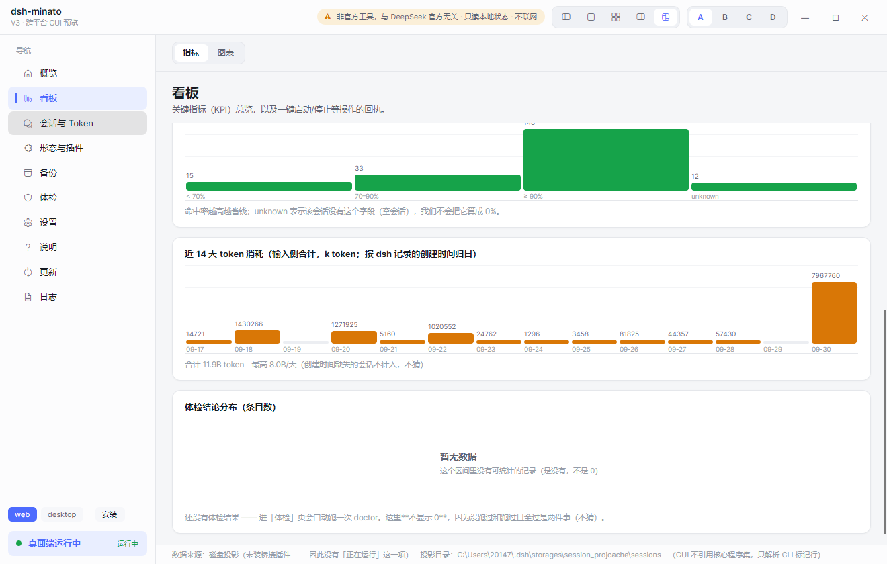
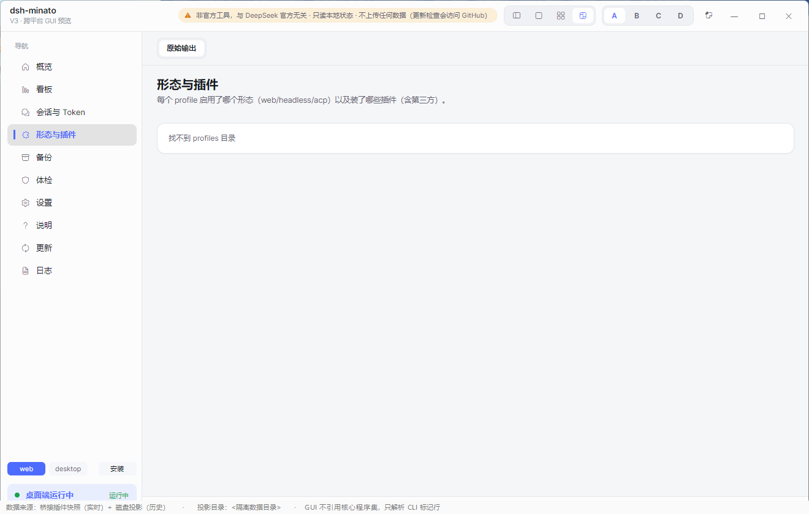
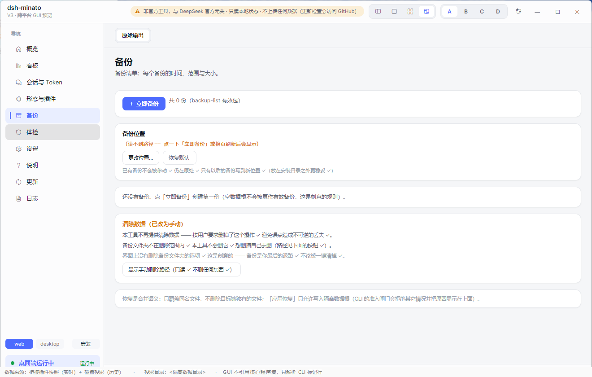
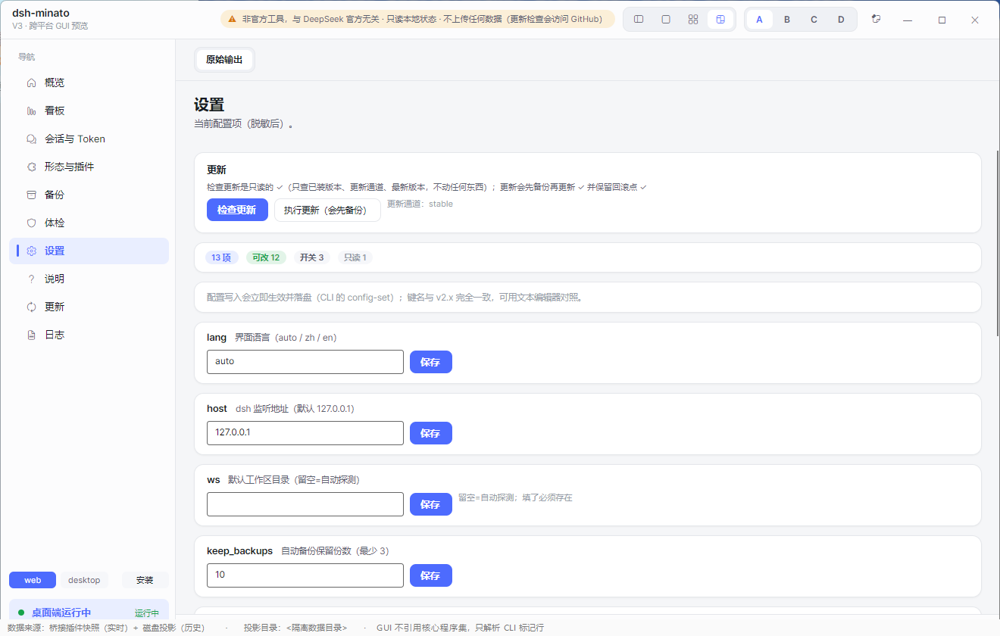
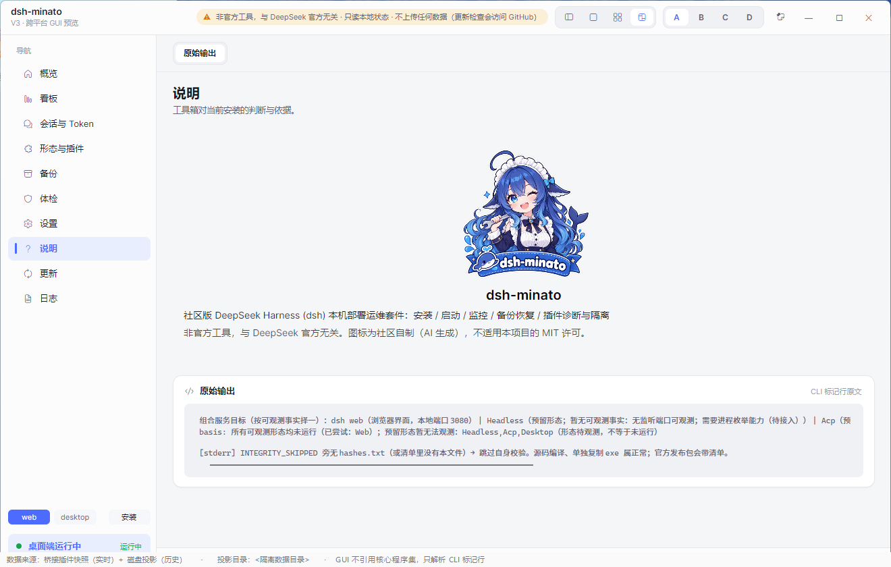
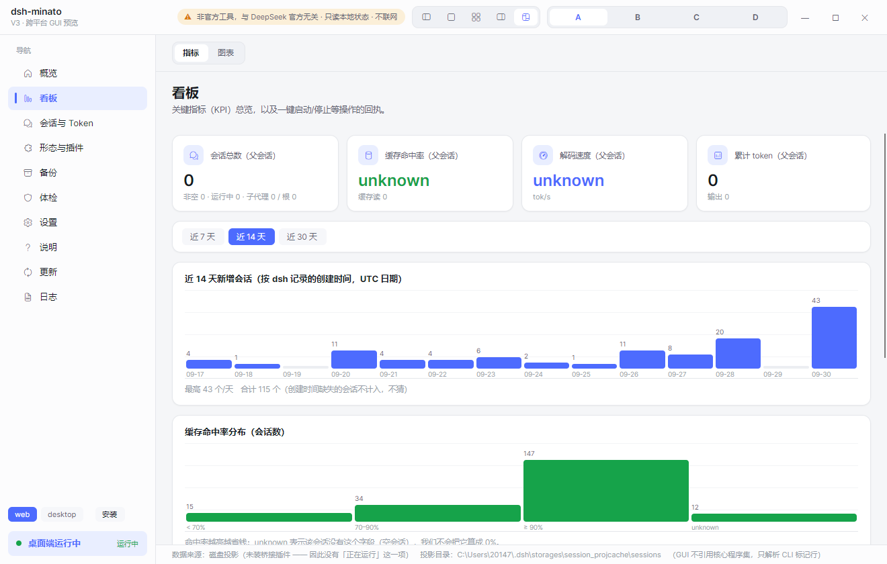
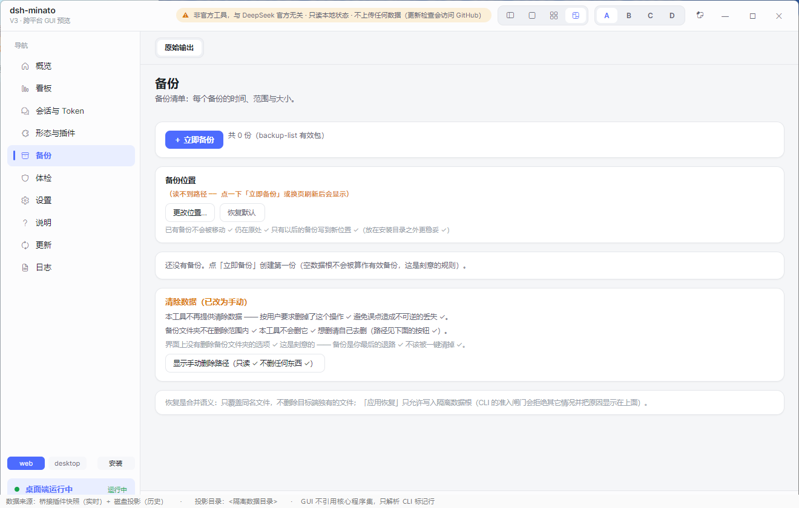
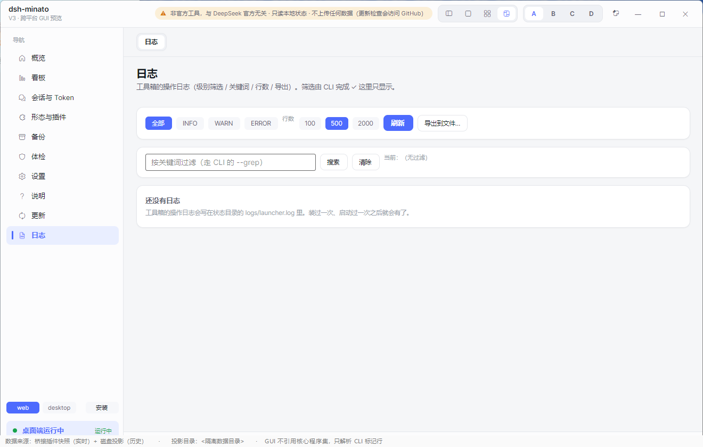
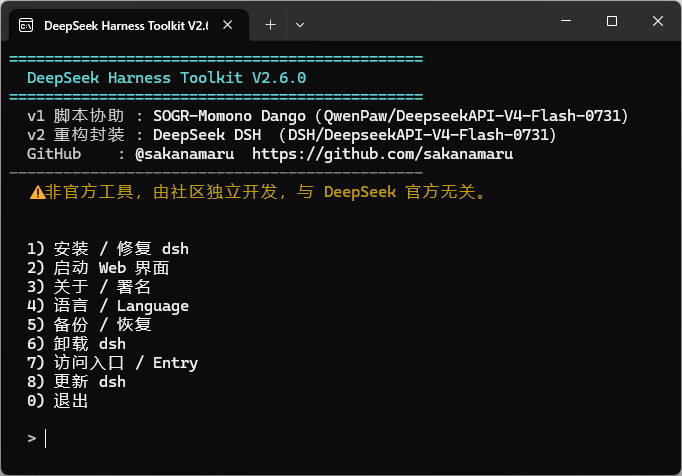
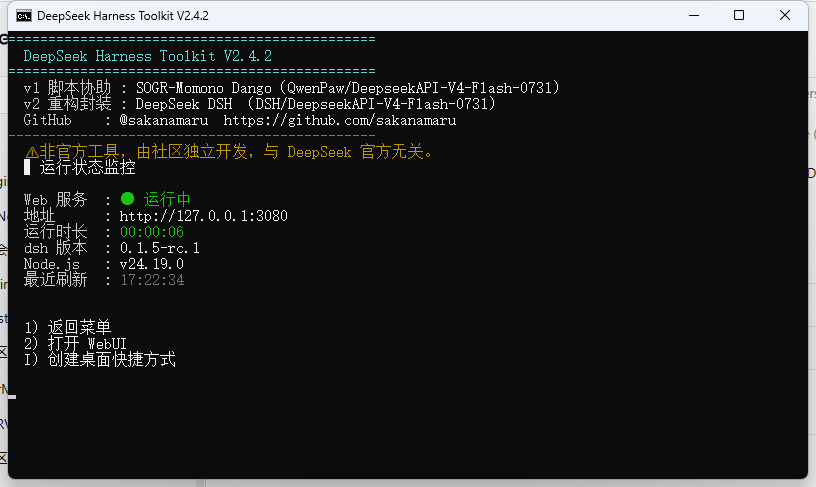

# DeepSeek Harness Toolkit — `dsh-minato`

**给 DeepSeek Harness（dsh）Web UI 用的安装 / 监控 / 备份 / 修复工具箱：不用终端，双击即用。**
支持 Windows 与 Linux。只在本机读写，不上传任何数据。

> ⚠️ **非官方工具。** 本项目与 DeepSeek 官方无关，也未获其认可或授权；它只是驱动你已有的 `dsh` 命令行。
>
> [English](README.md) · **简体中文** · [日本語](README_ja.md)

---

<p align="center">
  
</p>

## 界面截图

下面全是真实界面，但数据来自一个**隔离的夹具目录** —— 图中不含任何真实会话、路径或数字。

| 看板 | 会话与 Token | 备份 |
|---|---|---|
|  |  |  |

| 体检 | 设置 | 更新 |
|---|---|---|
|  |  |  |

<details>
<summary>其余页面（概览 / 形态与插件 / 说明 / 日志）与命令行</summary>

| 概览 | 形态与插件 | 说明 | 日志 |
|---|---|---|---|
|  |  |  |  |

| 命令行菜单 | 命令行状态 |
|---|---|
|  |  |

</details>

---

## 它能做什么

| | |
|---|---|
| **装 dsh** | 双击即可。不用懂终端，也不用懂 Node.js。它会装好命令行、配好 PATH 与开始菜单，并在安装目录旁留一个卸载器。 |
| **启动 / 停止 / 监控** | 一个按钮拉起 Web UI，并给出实时状态与要打开的网址。 |
| **备份与恢复** | 会话、设置、凭据 —— 包里有**完成标记**与逐文件哈希，**被中断或被篡改的包会被拒绝**，而不是照恢复。 |
| **备份管理器** | 动手之前先看清每个包里到底有什么。 |
| **换电脑迁移** | 导出包，在新机器上导入。 |
| **更新中心** | Web UI、官方桌面端、本工具、已装插件，都在一处更新。 |
| **体检** | 「到底哪里坏了？」—— 它会指出坏在哪个条目，并给出修它的那一行。 |
| **卸载** | **默认绝不删你的数据**，并且**拒绝删除不像安装目录的目录**。 |

---

## 安装

### Windows

从 [Releases](../../releases) 下载 `dsh-minato-<版本>-win-x64-setup.exe` 并运行。

- 安装器**没有数字签名**，首次运行可能出现 SmartScreen「未知发布者」提示。这正是未签名程序的样子 ——
  请先用公布的 `.sha256` 校验下载。
- 想用免安装版？下载 `dsh-minato-win-x64.zip`，解压后运行 `gui\dsht-gui.exe`。

### Linux

下载 `dsh-minato-linux-x64.tar.gz`，然后：

```bash
tar -xzf dsh-minato-linux-x64.tar.gz
cd dsh-minato-linux-x64
./install.sh            # 装到当前用户；用 --prefix <目录> 指定位置
```

卸载：`./install.sh --uninstall`（只有你自己挪过安装位置时才加 `--force`）。

---

## 快速上手

1. 按上面的方式装好，打开 **dsh-minato**。
2. 看板会显示当前状态。如果缺 `dsh`，体检会告诉你，并给出修法。
3. 点**启动**，打开它给出的 Web UI 网址。
4. 动手改任何东西之前，先点**备份**。

---

## 图形界面

左侧导航共十页：

| 页面 | 用途 |
|---|---|
| **概览** | 一屏看完：装了什么、在跑什么、什么该更新了。 |
| **看板** | 关键指标 —— 会话数、缓存命中率、token —— 以及一键启动/停止。 |
| **会话与 Token** | 逐会话明细，父子会话分组，可排序。 |
| **形态与插件** | 某个 profile 装了哪些插件、哪些被禁用、哪些会让 dsh 起不来。 |
| **备份** | 创建、查看、校验、恢复、导出、删除备份包。 |
| **体检** | 「哪里坏了」报告，附确切处方。 |
| **设置** | 语言、端口、行为 —— 不用改 YAML。 |
| **说明** | 版本、致谢，以及本工具**有意不做**的事。 |
| **更新** | 更新 dsh、桌面端、本工具或插件。 |
| **日志** | 过滤、搜索、导出启动器日志。 |

---

## 命令行

图形界面调的就是同一个命令行，它也可以单独用：

```text
dsh-minato status [--detail]      装了什么 / 在跑什么 / 谁在监听
dsh-minato start | stop           启动或停止 dsh Web UI
dsh-minato install | update       安装或更新 dsh（以及本工具）
dsh-minato uninstall              卸载本工具（绝不碰你的数据）
dsh-minato sessions               逐会话 token 与缓存数字
dsh-minato backup [--to <目录>]    创建一个备份包
dsh-minato backup-list [--verify] 列出备份包，并校验其内容
dsh-minato backup-dir [--set <d>] 备份写到哪
dsh-minato restore --path <包> [--apply] [--yes]
dsh-minato backup-export | backup-delete
dsh-minato doctor                 完整体检，附处方
dsh-minato profiles | profilecheck | profilepatch | bridge-install
dsh-minato bootdiag               dsh 为什么起不来？
dsh-minato verify-install         校验你下载的文件
dsh-minato log | config-get | config-set | autostart | shortcut
dsh-minato version | about | selftest
```

每条命令都会打印**机器可读的标记行**（`STATUS_OK`、`BACKUP_OK`、`RESTORE_FAIL` …），
这样脚本和图形界面能解析结果，而不是从散文里猜。

---

## 安全与隐私 —— 只写**代码真的做了**的事

本节只陈述代码的行为。如果这里写了代码没做的事，那就是 bug，请提 issue。

- **只在本机。** 工具只读写你自己的机器。**只有**这些命令会联网：`check`、`update-info`、`update-center`、`doctor`、`install`、`update`、`verify-install --url`。其余（status、sessions、backup、restore、doctor、日志）**绝不联网**。
- **该保护的地方有保护。** `restore` 之前**总会**先备份；`update`/`import` 会尝试备份、失败仍继续；`wipe` 只打印手动删除路径、不删也不备份并打印位置，失败可回滚。
  但**并非所有写操作**都会先备份：改设置（`config-set`、`backup-dir --set`）、改 profile、改快捷方式/PATH 不会。
- **卸载不会删你的数据。** 卸载只删本工具自己的文件；删数据是另一个需要你明确发起的动作。
- **备份的完整性是**校验**出来的，不是假设的。** 包里有**最后写入**的完成标记与逐文件哈希；
  被中断过的、或内容变过的包会被拒绝。
- **命令行 / 安装器 / 启动器 / dsh 插件：运行时零第三方依赖。**
  **图形界面基于 Avalonia**（一个 UI 框架），这是唯一的例外 —— 见 [PRIVACY.md](PRIVACY.md) 与 [ASSETS.md](ASSETS.md)。
- **没有遥测、没有账号、没有上传。**

---

## 排错

**「dsh 起不来」，或某个插件加载失败。** 跑体检 —— 它会指出有问题的 profile 条目，并给出要改的那一行：

```bash
dsh-minato doctor              # 只读：哪些条目会让 dsh 起不来？
dsh-minato profilecheck        # 同一个问题，按 profile 逐个看
```

**恢复或备份被拒绝了。** 那是**故意的**。先看清包里到底有什么：

```bash
dsh-minato backup-list --verify
```

**杀毒软件拦了安装器。** 一个自解压安装器会往 `%LOCALAPPDATA%` 写文件、改 PATH、建快捷方式 ——
这些行为看起来就像投放器，哪怕它并不是。请先用公布的 `.sha256` 校验，或者改用 zip（没有自解压外壳）。

---

## 从源码构建

命令行与工具是纯 C# 与 PowerShell —— 不依赖任何第三方包。

```powershell
# Windows 命令行（用系统自带的编译器就够）
csc /target:exe /out:dsh-minato.exe (Get-ChildItem v3\src -Recurse -Filter *.cs).FullName

# 图形界面（需要 .NET SDK，因为 Avalonia 是 NuGet 包）
dotnet build v3\gui\Dsht.Gui.Avalonia\Dsht.Gui.Avalonia.csproj -c Release
```

```bash
# Linux 命令行
dotnet publish v3/src/Dsht.Cli/Dsht.Cli.csproj -c Release -r linux-x64 --self-contained true -p:PublishSingleFile=true
```

---

## 开发与测试

本 README 里的每条结论都有一道可以本地跑的门槛在守：

| 门槛 | 它证明什么 |
|---|---|
| `v3/tests/verify_switchover.ps1` | 九道就绪门槛一次跑完 —— 想只跑一条就跑它。 |
| `v3/tests/compare_markers.ps1` | 命令行的机器可读输出仍与 v2.x 契约一致。 |
| `v3/tests/verify_fixes.ps1` | 70 个已修缺陷**仍然**在源码里被修着。 |
| `v3/tests/verify_restore_apply.ps1` | 在隔离根里做一次**真实**恢复，且**零越界写入**。 |
| `v3/tests/Dsht.Contracts.Tests` | 334 项领域与平台契约检查。 |
| `v3/gui/Dsht.Gui.LogicTests` | 58 项图形界面标记解析检查。 |
| `plugin/dsh-minato-bridge/test` | 23 项插件检查，含依赖声明。 |
| `v3/tools/verify_backup_chain.sh` | 备份可信链端到端（Linux）。 |
| `v3/tools/verify-linux.sh` | 发布用的 tar 包确实是它声称的东西。 |

同样的门槛在 CI 里每次推送都跑，Windows 与 Linux 各一遍。

---

## 状态

**V3 是预览版。** 命令行与 Linux 工具已完整，并在真机上验证过；图形界面十个页面已功能齐全，仍在打磨。
**V2.x 会继续维护**，直到 V3 功能完全对等。

已知限制，如实写明：

- Windows 产物**没有数字签名**（免费代码签名的申请被拒）。请校验哈希。
- `verify_fixes.ps1` 是**文本匹配**：它能确认"修复还在代码里"，**不能**确认那段代码可达。
- 图形界面基于 Avalonia，因此**不是零依赖** —— 项目其余部分是。

---

## 许可与致谢

MIT —— 见 [LICENSE](LICENSE)。隐私说明见 [PRIVACY.md](PRIVACY.md)；素材许可与图标来源见 [ASSETS.md](ASSETS.md)。

`dsh-minato`（みなと，「港」）曾用名 `DeepSeek-Harness-Toolkit`，改名记录在 git 历史里。
本项目是独立项目，与 DeepSeek 官方无关。


---

## 桥接插件（可选）—— 用途与建议

工具箱本体是**独立进程**：不注入 dsh，**dsh 没装也能用**。但有一个事实**只有 dsh 进程自己知道**：

> **当前有几个会话正在运行**（以及每个会话的实时 token / 上下文压力）。

这是**进程内的运行态**，dsh **不落盘** —— 所以磁盘投影里没有它，工具箱只能显示 `unknown`。

| | 不装插件 | 装了插件 |
|---|---|---|
| 会话清单 / token / 命中率 / 解码速度 | ✅（读磁盘投影） | ✅（读磁盘投影） |
| **「运行中」标记** | ❌ `unknown` | ✅ **实时** |

**它不做什么**（硬约束）：❌ 不发模型请求（不消耗 token）· ❌ 不写 dsh 状态 · ❌ 不读会话正文 ·
❌ 不联网 · ❌ 不阻塞（全 try/catch，**插件坏了不能影响 dsh**）。

**要不要装？** —— 看你实际怎么用：

- **只在命令行用** → **不需要** ✓。`unknown` 只影响一个字段，其余功能一点都不缺。
- **常看 GUI 的「会话与 Token」页、想知道"现在到底有没有在跑"** → **值得装** ✓（一条命令）。

```bash
# 直接填仓库地址（仓库根已声明 dsh.bundle，可安装）
dsh plugin --profile web add "https://github.com/sakanamaru/dsh-minato"

# 或本地目录（最稳，不依赖网络）
dsh plugin --profile web add "<本仓库路径>/plugin/dsh-minato-bridge"
```

> ⚠️ `desktop` profile **由 dsh 桌面端独占管理**，命令行装不进去 —— 请在桌面端的「添加插件」
> 对话框里粘贴上面任一条。装完还要确认该 profile 的 `cordis.patch.yml` 里有 `shio-bridge` 行：
> 缺了插件**不会加载**，而 dsh **不会报错**（这是实测踩过的坑）。

**装不装由你决定** ✓ —— 本工具不替你决定，也不假装它必需。

## 为什么没什么人用，还在更新

老实说：这个项目**用户不多**。还在更新的理由，按实际权重排：

1. **我自己在用** —— 它是给我自己解决实际问题的工具；别人用不用，不影响它对我的价值。
2. **练手** —— 把「跨平台 CLI + GUI + 备份恢复 + 发布链 + CI」这一整套做扎实，本身就是目的。
3. **做出来了就该维护到底** —— 半成品烂尾在那里，比从没做过更让人难受。
4. **给后来者留个能用的东西** —— 万一有人踩到同样的坑，至少有一份可读、可复核、不骗人的实现。

这也是为什么这里的**文档比代码还啰嗦**：把"哪里不确定"写出来
（`unknown` 不伪装成 0、门槛跑不到的检查明说、没验证过的修复如实标注），比多一个功能更重要。

## 关于「AI 协助」

这个项目的开发过程里**大量使用了 AI 协助**。写清楚是为了让你能自己判断可信度：

- **v1 脚本协助**：SOGR-Momono Dango（QwenPaw / DeepseekAPI-V4-Flash-0731）
- **v2 重写与打包**：DeepSeek DSH（DSH / DeepseekAPI-V4-Flash-0731）
- **v3 与本文档**：以 AI 编码代理为主，由维护者审查、决策与验收
- **图标**：**新 logo 为生成式 AI 产出（工具：Kimi）**，**旧 logo 为 ChatGPT（OpenAI）协助产出**；提示词均由维护者编写

**这不代表"AI 写的所以不可信"，也不代表"AI 写的所以没问题"。**
判断依据应该是**能不能自己复核**：所有产物都附 SHA-256（`hashes.txt`），
所有结论都能用 `v3/tests/` 与 `verify.ps1` 自己重跑一遍。